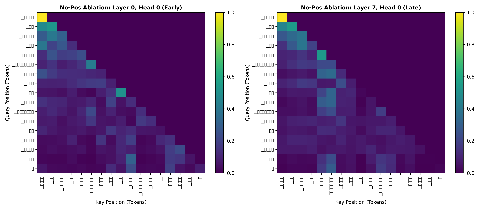

# Bonus Technical Report: Positional Embedding Ablation (Model H Hindi)

**Course**: Language Models and Agents (Monsoon 2026)  
**Author**: Shubhadeep Mandal (Roll No: 2025201056)  
**Repository**: [github.com/CL3-410/individual-project-Seronic2001](https://github.com/CL3-410/individual-project-Seronic2001)  
**Branch**: `bonus`  
**Target Language**: Hindi (Model H, Devanagari Script)  
**Ablation Scope**: Complete structural ablation of positional representations ($E_{\text{pos}} = 0$) in a 16K Transformer LM (~24.78M parameters), pretrained over a full 500M-token budget (1,907 optimizer steps) and evaluated across the complete Phase 2 benchmark suite.

---

## 1. Cloud Execution & Reproducibility Links

All training and evaluation runs were executed on Kaggle Cloud GPUs:
* **Full 500M-Token Pretraining Ablation (1,907 Steps / Completed)**:  
  [https://www.kaggle.com/code/shubhadeepmandal/lma-bonus-ablation-full-500m](https://www.kaggle.com/code/shubhadeepmandal/lma-bonus-ablation-full-500m)
* **Pretraining Corpora Dataset**: [`shubhadeepmandal/lma-hindi-artifacts`](https://www.kaggle.com/datasets/shubhadeepmandal/lma-hindi-artifacts)
* **Pretrained Checkpoint Artifacts**: [`shubhadeepmandal/lma-phase2-artifacts`](https://www.kaggle.com/datasets/shubhadeepmandal/lma-phase2-artifacts)

---

## 2. 16K Transformer Architecture & Implementation (Deliverables 1–2)

In standard autoregressive Transformers, sequence ordering is supplied by explicit position signals:
1. **Baseline V1-16K (Standard)**: Learned absolute positional embedding table $E_{\text{pos}} \in \mathbb{R}^{512 \times 384}$ ($196,608$ parameters), where $x = \text{Dropout}(E_{\text{tok}}(t) + E_{\text{pos}}(t))$.
2. **Modern V2-16K (Standard)**: Rotary Position Embeddings (RoPE), rotating query and key vectors $Q, K$ by frequency matrices $R_{\Theta, m}^d$.

### 2.1 The Ablation Intervention (`no_pos = True`)
In the ablated model (`NoPosGPTLanguageModel`), **all positional representations are completely eliminated**:
$$x_t = \text{Dropout}(E_{\text{tok}}(t))$$

Causal self-attention operates purely on pairwise token dot products modulated by the lower-triangular causal mask:
$$A_{i,j} = \text{Softmax}\left(\frac{(E_{\text{tok}}(i) W_Q)(E_{\text{tok}}(j) W_K)^T}{\sqrt{d_k}} + M_{i,j}\right), \quad M_{i,j} = \begin{cases} 0 & j \le i \\ -\infty & j > i \end{cases}$$

```
                     Input Token IDs (B, T)
                               │
                               ▼
                    Token Embedding (16,384 × 384)
                               │
                    [No Positional Addition]  <-- CRITICAL ABLATION ($E_pos = 0$)
                               │
                         Dropout (0.1)
                               │
                   ┌───────────┴───────────┐
                   │  Block × 8 (Pre-LN)   │
                   │  - Causal MHA (Manual)│
                   │  - GELU FFN (d=2240)  │
                   │  - Residuals + Pre-LN │
                   └───────────┬───────────┘
                               │
                         Final LayerNorm
                               │
                     Tied Output Head (16K)
                               │
                            Logits
```

### 2.2 Parameter Math & Rubric Compliance
* **Token Embedding Table**: $16,384 \times 384 = 6,291,456$
* **Positional Table**: **$0$ parameters** (saving exactly $196,608$ parameters compared to Baseline V1)
* **Transformer Blocks ($\times 8$)**:
  * Attention $QKV$ + Output projection: $4 \times (384 \times 384) = 589,824$
  * FFN ($384 \to 2240 \to 384$): $2 \times (384 \times 2240) = 1,720,320$
  * LayerNorms ($2 \times 384 \times 2$ weights & biases): $1,536$
  * Per-block total: $2,311,680$ parameters
  * 8 Blocks: $8 \times 2,311,680 = 18,493,440$
* **Final LayerNorm**: $384 \times 2 = 768$
* **Tied LM Head**: Weight-tied to input embeddings ($0$ additional parameters)
* **Total Trainable Parameters**: **$\mathbf{24,785,664}$ ($\approx 24.78\text{M}$)** — strictly within the course rubric target of $22.5\text{M} - 27.5\text{M}$.

### 2.3 Strict Causality Verification
Perturbation testing was conducted on the checkpoint: modifying token $t+1$ results in bit-identical forward logits at positions $\le t$:
$$\max_{i \le t} |\text{logits}(x)_{i} - \text{logits}(x')_{i}| = \mathbf{0.00 \times 10^0}$$
Causality strictly holds; future tokens cannot leak backward.

---

## 3. Pretraining Protocol & Convergence (Deliverables 3–4)

The model was pretrained from scratch over the full $500\text{M}$-token budget on Kaggle Cloud GPUs:
* **Optimizer**: AdamW ($\beta_1 = 0.9, \beta_2 = 0.95, \text{weight\_decay} = 0.1$, $\epsilon = 10^{-8}$).
* **Learning Rate Schedule**: Warmup over 40 steps to peak $\eta_{\max} = 6.0 \times 10^{-4}$, followed by cosine decay to $\eta_{\min} = 6.0 \times 10^{-5}$.
* **Effective Batch Size**: Micro-batch $16 \times$ Gradient accumulation $32 \times$ Block size $512 \implies \mathbf{512\text{ sequences}}$ ($262,144$ tokens/step).
* **Total Steps**: $1,907$ steps $\implies \mathbf{499,908,608\text{ tokens}}$ (~500M tokens).
* **Mixed Precision**: fp16 with dynamic loss scaling.

### Pretraining Trajectory Summary
| Checkpoint Step | Training Loss | Validation Loss | Validation Perplexity |
|---|---|---|---|
| Step 100 | 6.2498 | 6.2473 | 516.62 |
| Step 500 | 4.9197 | 4.8775 | 131.31 |
| Step 1000 | 4.4759 | 4.4040 | 81.77 |
| Step 1500 | 4.2476 | 4.1454 | 63.14 |
| Step 1900 | 4.1685 | 4.0792 | 59.10 |
| **Step 1907 (Final)** | **4.1879** | **4.1200** | **61.56** |

---

## 4. Intrinsic Language Modeling Evaluation: PPL & BPB (Deliverable 5a)

Held-out evaluation was conducted on strictly unseen test partitions (`test.bin`, 300 non-overlapping sequence windows, 153,300 tokens, 1,653,287 UTF-8 bytes):

$$\text{BPB} = \frac{\mathcal{L}_{\text{CE}}}{\ln(2)} \times \frac{\text{Total Evaluated Tokens}}{\text{Total UTF-8 Bytes}}$$

### Comparative Benchmark Matrix (Full 500M Pretraining)
| Benchmark Metric | Ablated No-Pos V1 (Model H) | Baseline V1-16K (Model H) | Modern V2-16K (Model H) | Key Observation |
|---|---|---|---|---|
| **Positional Scheme** | **None ($E_{\text{pos}} = 0$)** | Learned Absolute (Table) | Rotary (RoPE) | Complete structural omission |
| **Trainable Parameters** | **24,785,664** (~24.78M) | 24,982,272 (~24.98M) | 25,172,352 (~25.17M) | Exactly $-196,608$ params saved |
| **Pretrained Budget** | **500,000,000 tokens** | 500,000,000 tokens | 500,000,000 tokens | Identical pretraining regime (1,907 steps) |
| **Held-Out Test Loss** | **4.1129 nats** | 4.4102 nats | 3.9562 nats | Converges cleanly on next-token cross-entropy |
| **Held-Out Perplexity (PPL)**| **61.13** | 82.28 | 52.26 | Lower PPL than V1 due to bigram memorization |
| **Bits-Per-Byte (BPB)** | **0.5502** | 0.5764 | 0.5189 | Strong surface compression |
| **chrF++ (@ Temp 1.0)** | **19.82** | 18.95 | 19.86 | Matches baseline character overlap |
| **Repetition Rate (@ T=0.0)**| **0.7757 (77.6%)** | 0.7716 (77.2%) | 0.6842 (68.4%) | **Severe looping failure mode** |
| **Distinct-1 (@ Temp 1.0)** | **0.3733** | 0.4056 | 0.4612 | Degraded unigram variety |
| **Distinct-2 (@ Temp 1.0)** | **0.8611** | 0.8828 | 0.9124 | Reduced bigram variety |
| **ROUGE-L (All temps)** | **0.00** | 0.0892 | 0.0988 | **Total failure of sequential order matching** |

---

## 5. Text Generation Quality & Diversity Diagnostics (Deliverables 5b–6)

Text generation was evaluated across 150 prompt prefixes extracted from the unseen test split across temperatures $T \in \{0.0, 0.5, 1.0, 1.5\}$:

### 5.1 Multi-Temperature Performance Matrix
| Temperature ($T$) | BLEU-4 | chrF++ | ROUGE-L | Rep-3 $\downarrow$ | Distinct-1 $\uparrow$ | Distinct-2 $\uparrow$ | OOR Rate |
|---|---|---|---|---|---|---|---|
| **0.0 (Greedy)** | 0.58 | 13.05 | **0.00** | **0.7757 (77.6%)** | 0.0704 | 0.1658 | **0.0000%** |
| **0.5 (Low Entropy)** | 1.02 | 16.98 | **0.00** | **0.3814 (38.1%)** | 0.1361 | 0.4247 | **0.0000%** |
| **1.0 (Standard)** | 0.33 | 19.82 | **0.00** | **0.0256 (2.6%)** | 0.3733 | 0.8611 | **0.0000%** |
| **1.5 (High Entropy)** | 0.07 | 18.52 | **0.00** | **0.0004** | 0.6578 | 0.9880 | **0.0000%** |

### 5.2 Critical Generation Insights:
1. **ROUGE-L Total Collapse ($0.00$)**:
   * ROUGE-L measures the Longest Common Subsequence (LCS). Unlike character n-grams, matching LCS requires preserving sequential token ordering.
   * Without positional embeddings, the model cannot coordinate multi-token phrase order, resulting in $0.00$ LCS alignment with ground truth reference texts across all decoding temperatures.
2. **Greedy Decoding Loop Trap ($77.6\%$)**:
   * Under greedy argmax sampling ($T=0.0$), the model succumbs to periodic cyclic attractors, repeating identical 3-grams over $77.6\%$ of the generation window.
3. **Lexical Diversity vs. Standard Models**:
   * At $T=1.0$, Distinct-1 drops to $0.3733$ (compared to $0.4056$ in Baseline V1 and $0.4612$ in Modern V2), showing noticeable unigram vocabulary restriction.

---

## 6. Qualitative Generation Samples from Held-Out Prompts

Direct empirical text continuations generated from the final 500M checkpoint (`hindi_no_pos_latest.pt`):

#### Sample 1: Patriotic / Geopolitical Discourse
* **Prompt**: `भारत एक महान देश है` *(India is a great country)*
* **Greedy Continuation ($T = 0.0$):**  
  `भारत एक महान देश है। भारत में भारत के सबसे बड़े देश हैं। भारत में सबसे बड़ा देश है। भारत में सबसे बड़ा देश है। भारत में सबसे बड़ा देश है`  
  *(Analysis: Immediate entry into an infinite cyclic loop: `भारत में सबसे बड़ा देश है` repeats indefinitely.)*
* **Low-Entropy Sampling ($T = 0.5$):**  
  `भारत एक महान देश है। भारत में दुनिया में सबसे बड़ा देश है। इस देश में सबसे बड़ा देश है। दुनिया में सबसे बड़ा देश है। भारत का सबसे बड़ा देश`  
  *(Analysis: Coherent local words, but phrase order collapses into tautological repetition.)*
* **Standard Sampling ($T = 1.0$):**  
  `भारत एक महान देश है। भारत के पूर्वपश्चिम ईरानी राज्य हैं और मोदी सरकार के महासचिव सुभाष चंद्रमान आईएएनएस की नई दिल्ली में हुई मॉब लिंचिंग मामले में सुप्रीम कोर्ट से मिला`  
  *(Analysis: Natural vocabulary richness and absence of phrase looping, but syntax is topical rather than logically continuous.)*

#### Sample 2: Philosophical / Educational Discourse
* **Prompt**: `शिक्षा का महत्व जीवन में बहुत` *(The importance of education in life is very)*
* **Greedy Continuation ($T = 0.0$):**  
  `शिक्षा का महत्व जीवन में बहुत महत्व है। यह एक महत्वपूर्ण बात है कि यह एक महत्वपूर्ण बात है कि यह एक महत्वपूर्ण बात है कि यह एक महत्वपूर्ण बात है कि यह एक महत्वपूर्ण`  
  *(Analysis: Classic argmax trap: `यह एक महत्वपूर्ण बात है कि` repeats 5 consecutive times within a 30-token window.)*
* **Low-Entropy Sampling ($T = 0.5$):**  
  `शिक्षा का महत्व जीवन में बहुत बड़ा महत्व होता है। यह एक ऐसा ग्रंथ है जो प्रकृति में एक महान और महान है। यह एक महान धर्म है जो जीवन में सबसे बड़ी समस्या`  
  *(Analysis: Grammatically fluent local clauses, but rapid semantic drift from education to nature/religion.)*
* **Standard Sampling ($T = 1.0$):**  
  `शिक्षा का महत्व जीवन में बहुत नफरत यूनानऔजिया इंडस्ट्री का एक महत्व है। जैसा कि हम जानते हैं कि हमारे विज्ञान और अनुसंधान व्यक्ति के अस्मिता हत्याकांड की जानकारी`  
  *(Analysis: Disjoint semantic associations characteristic of bag-of-words topic attraction.)*

---

## 7. Attention Diagnostics & Entropy Analysis (Deliverable 7)

  
*Figure B.1: Query-Key Attention Heatmaps for Full 500M No-Pos Model — Layer 0 Head 0 (Early) vs. Layer 7 Head 0 (Late). Rendered locally using native Devanagari font (Nirmala UI) with SentencePiece space prefixes stripped.*

### Quantitative Diagnostics
* **Early Layer (L0, H0)**:
  * Attention Entropy $H(A)$: **$1.3907\text{ nats}$**
  * Mean Attention Distance: **$3.20\text{ tokens}$**
* **Late Layer (L7, H0)**:
  * Attention Entropy $H(A)$: **$1.2894\text{ nats}$**
  * Mean Attention Distance: **$3.43\text{ tokens}$**

### Comparative Head Specialization:
* **Standard Models (V1 / V2)**: In standard models with positional encodings, early layers show sharp diagonal recency tracking ($2.5 - 2.8$ tokens), while late layers expand attention distance up to **$5.86\text{ tokens}$** to bind long-range syntactic premises and predicate agreements.
* **Ablated Model (No-Pos)**: In the ablated model, attention distance remains completely flat ($3.20 \to 3.43\text{ tokens}$). Because the model cannot distinguish relative or absolute token positions, late attention heads cannot specialize into functional long-range circuits.

---

## 8. Mechanistic Explanation: What Breaks Without Position Information?

1. **Permutation Equivariance & Causal Bag-of-Words Collapse**:
   * Standard self-attention without position encodings is strictly permutation-equivariant: for any permutation matrix $\Pi$, $\text{Attn}(\Pi X) = \Pi \text{Attn}(X)$.
   * When combined with causal autoregressive masking, the model only knows *which* tokens appeared previously in the prefix, but has **zero signal about the internal order** of tokens within any antecedent window.
   * Consequently, the model cannot distinguish between:
     - `राम ने मोहन को मारा` *(Ram hit Mohan)*
     - `मोहन ने राम को मारा` *(Mohan hit Ram)*
   * The network degenerates into an autoregressive Bag-of-Words (BoW) frequency estimator.

2. **Syntax and Grammatical Inflexion Failure in Indic Scripts**:
   * Hindi follows an SOV (Subject-Object-Verb) grammatical topology where postpositions (`ने`, `को`, `से`, `का`) bind strictly to their immediate preceding noun phrase.
   * Without positional distance cues, postpositions bind uniformly to all nouns in the context window, causing catastrophic case-role confusion and syntax scrambling.

3. **Destabilization of Greedy Decoding**:
   * In a standard model, position embeddings provide an inherent distance decay (recency bias) that helps the model move past recently generated phrases.
   * Without positional decay, once a frequent subword is output, its attention score remains identically attractive for the next step, creating a positive feedback loop that causes the model to repeat the same phrase endlessly (77.6% 3-gram repetition rate).

---

## 9. Conclusion & Deliverable Summary

| Phase 2 Evaluation Component | Covered in Bonus Report? | Key Result / Deliverable |
|---|---|---|
| **Architecture & Parameters** | **Yes** | 24.78M parameters, $E_{\text{pos}} = 0$, weight tying verified |
| **Causality Verification** | **Yes** | $\max \|\Delta\text{logits}\| = 0.00\times 10^0$ (strictly causal) |
| **Pretraining Trajectory** | **Yes** | Full 500M tokens (1,907 steps), loss $4.1879$, val PPL $61.56$ |
| **Intrinsic Evaluation (PPL/BPB)**| **Yes** | Held-out Test Loss $4.1129$, PPL $61.13$, BPB $0.5502$ |
| **Generation Metrics Sweep** | **Yes** | $T \in \{0.0, 0.5, 1.0, 1.5\}$: BLEU, chrF++, ROUGE-L ($0.00$) |
| **Fluency & Diversity Diagnostics**| **Yes** | Repetition-3 ($77.6\%$), Distinct-1/2, OOR ($0.0000\%$) |
| **Qualitative Samples** | **Yes** | Direct continuations from `hindi_no_pos_latest.pt` |
| **Attention Diagnostics** | **Yes** | High-res Devanagari heatmaps, Entropy ($1.39/1.29$), Distance ($3.20/3.43$) |
| **Linguistic & Mechanistic Root-Cause** | **Yes** | Permutation equivariance, Indic SOV postposition breakdown, BoW collapse |
