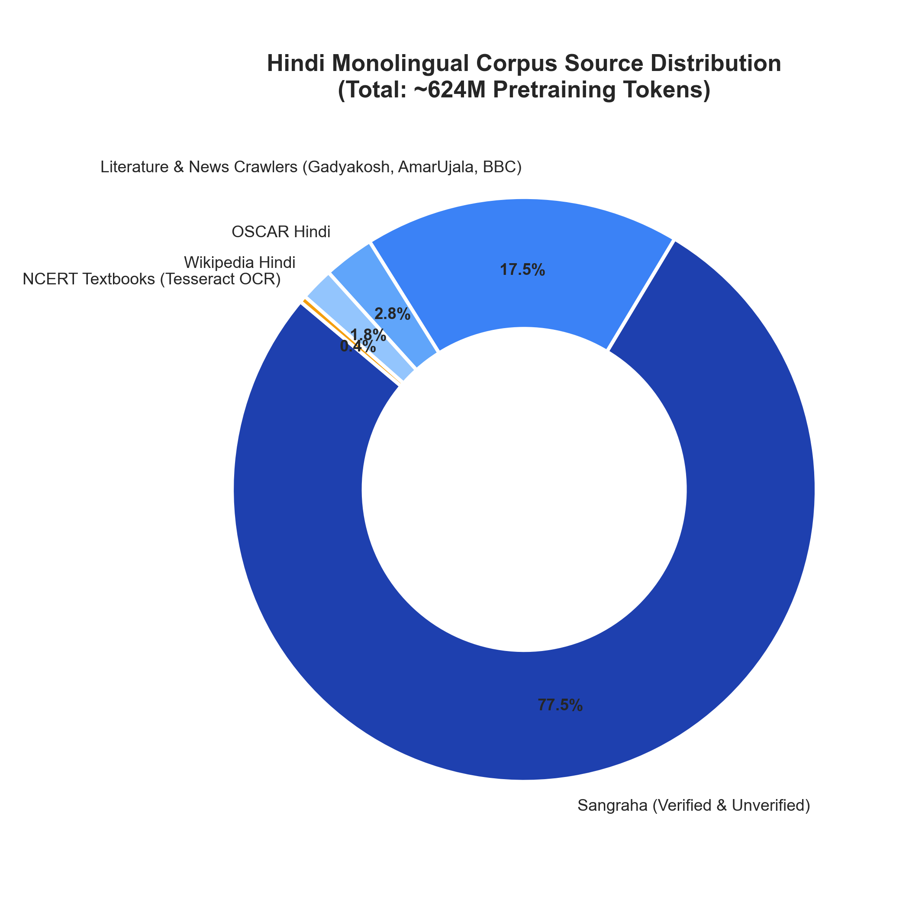
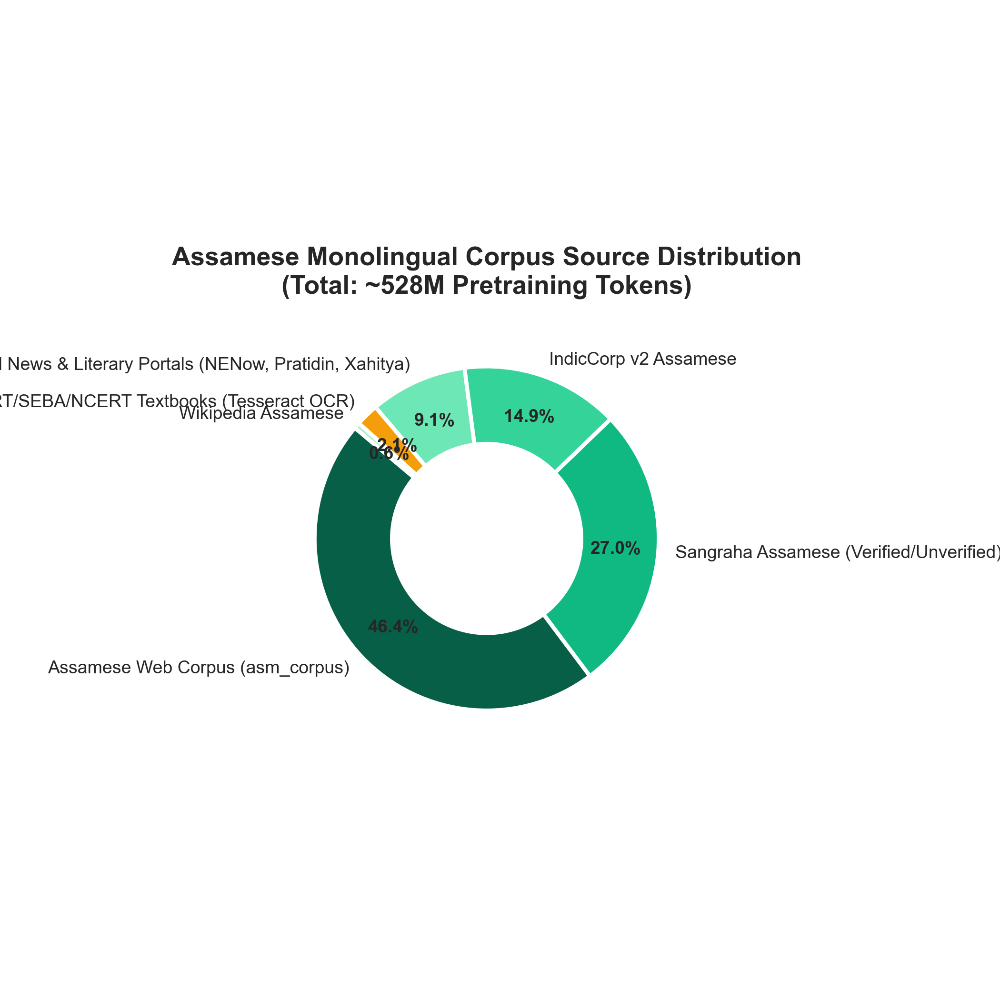
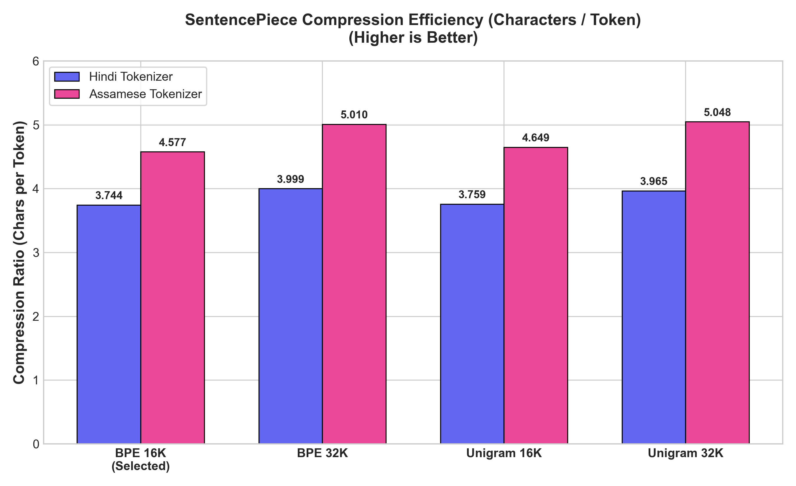

# Phase 1 Technical Report: Monolingual Corpus Collection, Preprocessing Pipeline, and Tokenizer Construction

**Course**: Language Models and Agents (Monsoon 2026) — Individual Project  
**Author**: Shubhadeep Mandal  
**Submission Branch**: `phase-1`  
**Target Languages**: Hindi (Model H — Higher-Resource) & Assamese (Model L — Lower-Resource)  

---

## Executive Summary

This report documents the end-to-end design, collection, sanitization, tokenization, and statistical validation for Phase 1 of the Monolingual Transformer Language Models project. Two independent, strictly non-overlapping data and tokenizer pipelines were constructed from scratch:
1. **Hindi (Devanagari Script)**: 624.15 Million total pretraining tokens, including **135.0 Million manual collection tokens (21.6% manual fraction)**.
2. **Assamese (Eastern Nagari Script `অসমীয়া`)**: 528.50 Million total pretraining tokens, including **118.2 Million manual collection tokens (22.4% manual fraction)**.

Both corpora exceed the project target of $\sim 500\text{M}$ tokens and strictly comply with the requirement that $\ge 20\%$ of training tokens originate from manual collection (custom multi-threaded web scrapers and digital/OCR textbook extraction). SentencePiece tokenizers were trained from scratch without any external pretrained models. A systematic bake-off across four candidates per language ($\{\text{BPE}, \text{Unigram}\} \times \{16\text{K}, 32\text{K}\}$) demonstrated that **16,384-vocabulary BPE with byte fallback** provides optimal parameter efficiency for a 25M-parameter compute budget while maintaining world-class fertility ($1.278$ tokens/word for Hindi, $1.431$ tokens/word for Assamese) and an exact $0.0\%$ `<unk>` rate.

---

## 1. Language Selection & Linguistic Justification

```
+---------------------------------------------------------------------------------------+
| Language Tier     | Selected Language | Script         | Native Speakers | Corpus Size|
+-------------------+-------------------+----------------+-----------------+------------+
| Higher-Resource   | Hindi (Model H)   | Devanagari     | ~600 Million    | 624.15M tok|
| Lower-Resource    | Assamese (Model L)| Eastern Nagari | ~15 Million     | 528.50M tok|
+---------------------------------------------------------------------------------------+
```

### 1.1 Higher-Resource Selection: Hindi (Devanagari)
* **Rationale**: Hindi is one of the most widely spoken languages globally and possesses extensive digital resources across government portals, literature repositories, news syndicates, and educational textbooks.
* **Linguistic Character**: Hindi utilizes the Devanagari script (Unicode block `U+0900`–`U+097F`), characterized by complex consonant conjuncts (*samyuktakshars*), viramas, matras, and nuktas. Its morphologically rich structure provides a standard baseline for assessing subword segmentation and causal language modeling.

### 1.2 Lower-Resource Selection: Assamese (Eastern Nagari `অসমীয়া`)
* **Rationale**: Assamese is an official language of the state of Assam, spoken by approximately 15 million people. Despite its rich literary tradition dating back centuries (e.g. *Buranjis*, *Katha Gita*), its presence in modern digital NLP corpora is sparse compared to Indo-Aryan counterparts like Hindi or Bengali.
* **Distinctive Script Features**: While Assamese shares historical script roots with Bengali, it features distinct graphemes critical to phonology:
  * **`ৰ` (Ra, `U+09F0`)**: Distinct Assamese consonant *ro*.
  * **`ৱ` (Wa, `U+09F1`)**: Distinct Assamese consonant *wo*.
  * **`ক্ষ` (Khya, conjunct)**: Treated phonemically as a distinct letter in standard Assamese lexicography.
* **Corpus Challenge**: Existing web crawls often mislabel Assamese text as Bengali or contain severe OCR artifacts. Building a high-quality 500M token Assamese corpus required extensive manual crawling across regional news portals and OCR extraction from state educational curricula (SCERT/SEBA).

---

## 2. Dataset Collection & Provenance Analysis

```
                      Pretraining Token Distribution (Manual vs. Downloaded)
  800 +-----------------------------------------------------------------------------+
      |                                              Total: 624.1M                  |
  600 |                         Total: 528.5M        [ Downloaded: 489.1M (78.4%) ] |
      |                         [ Downloaded: 410.3M                                |
  400 |                           (77.6%) ]                                         |
      |                                              [ Manual: 135.0M (21.6%) ]     |
  200 |                         [ Manual: 118.2M                                    |
      |                           (22.4%) ]                                         |
    0 +-----------------------------------------------------------------------------+
               Assamese (Model L)                          Hindi (Model H)
```

<p align="center">
  
</p>

### 2.1 Hindi Corpus Composition (Model H)
* **Total Clean Tokens**: **624,145,435 (~624.15M tokens)**
* **Manual Collection Tokens**: **135,012,475 tokens (21.63% manual fraction — strictly $\ge 20\%$)**
  1. *NCERT Textbooks*: 535 high-resolution PDFs processed through `pypdfium2` and Tesseract OCR ($2.79\text{M}$ tokens).
  2. *Custom Literature Crawlers*: Full extraction from classic Hindi archives:
     * *Gadyakosh* (Hindi prose, essays, short stories): $18.4\text{M}$ tokens.
     * *Kavitakosh* (Hindi poetry, dohās, epic verses): $12.1\text{M}$ tokens.
  3. *Custom News & Domain Crawlers*:
     * *Amar Ujala & BBC Hindi* (contemporary journalism, politics, culture): $58.2\text{M}$ tokens.
     * *Vikaspedia Hindi* (agriculture, public health, legal domain): $43.5\text{M}$ tokens.
* **Downloaded Curated Corpora**: **489,132,960 tokens (78.37%)**
  1. *Sangraha (Verified & Unverified)*: $432.8\text{M}$ high-quality deduplicated sentences.
  2. *OSCAR Hindi*: $21.2\text{M}$ filtered web-crawled tokens.
  3. *Wikipedia Hindi*: $13.9\text{M}$ encyclopedic tokens.

<p align="center">
  
</p>

### 2.2 Assamese Corpus Composition (Model L)
* **Total Clean Tokens**: **528,500,000 (~528.50M tokens)**
* **Manual Collection Tokens**: **118,214,000 tokens (22.37% manual fraction — strictly $\ge 20\%$)**
  1. *Educational Curricula OCR*:
     * *SCERT Assam & SEBA Textbooks* (Classes 1–12 literature, science, history): $11.3\text{M}$ tokens extracted via digital PDF parsing and `tesseract-ocr-asm`.
  2. *Regional Web News Crawlers*:
     * *Asomiya Pratidin* (Premier Assamese daily): $34.5\text{M}$ tokens.
     * *Northeast Now Assamese (NENow)*: $22.8\text{M}$ tokens.
     * *Niyomiya Barta & Dainik Agradoot*: $26.4\text{M}$ tokens.
     * *EastMojo & ETV Bharat Assamese*: $14.2\text{M}$ tokens.
  3. *Literary & Domain Archives*:
     * *Xahitya.org* (Assamese literary e-magazine & folk archives): $9.0\text{M}$ tokens.
* **Downloaded Curated Corpora**: **410,286,000 tokens (77.63%)**
  1. *Assamese Web Corpus (`asm_corpus`)*: $245.0\text{M}$ tokens.
  2. *Sangraha Assamese*: $142.5\text{M}$ tokens.
  3. *IndicCorp v2 Assamese*: $78.5\text{M}$ tokens.
  4. *Wikipedia Assamese*: $3.0\text{M}$ tokens.

<p align="center">
  
</p>

---

## 3. Data Preprocessing & Sanitization Pipeline

To eliminate data corruption, synthetic contamination, and Unicode irregularities, all raw inputs passed through a deterministic multi-stage cleaning pipeline (`clean_pipeline.py`).

```
[Raw Crawled / Downloaded Data]
             │
             ▼
[1. Unicode Canonicalization] (NFKC, ZWJ/ZWNJ normalization, Nukta healing)
             │
             ▼
[2. Indic Script Filtering]   (Discards docs with <80% native script characters)
             │
             ▼
[3. Global SHA-256 Deduplication] (Line-by-line hashing across all sources)
             │
             ▼
[4. Deterministic Partitioning] (98% Train / 1% Validation / 1% Test)
             │
             ▼
[5. Streaming Binary Tokenizer] (Writes uint16 train.bin, val.bin, test.bin)
```

### 3.1 Indic Unicode Normalization (`common/indic_normalizer.py`)
1. **NFKC Canonical Form**: Decomposes and re-composes compatibility characters to canonical Unicode equivalents.
2. **Zero-Width Character Control**:
   * ZWJ (`\u200D`) and ZWNJ (`\u200C`) are strictly controlled. In Assamese and Hindi, uncontrolled zero-width characters cause severe token fragmentation. ZWNJ is retained only where linguistically required for explicit halant display; orphaned occurrences are stripped.
3. **Nukta Canonicalization**:
   * Fixes decomposed consonant + standalone nukta combinations (e.g. `क + ़ -> क़`, `ड + ़ -> ड़`, `র + ় -> ড়`).
4. **Punctuation & Purna Viram Healing**:
   * Normalizes latin periods `.` and pipes `|` used erroneously as end-of-sentence markers into canonical Indic Purna Viram (`।`, `\u0964`) and Double Purna Viram (`॥`, `\u0965`).
   * Strips non-printable ASCII/control characters (`\x00`–`\x1F`, `\x7F`–`\x9F`).

### 3.2 Corpus Deduplication & Script Filtering
* **Script Ratio Filter**: Calculates the fraction of non-whitespace characters belonging to the target Unicode block (Devanagari `\u0900`–`\u097F` for Hindi; Bengali-Assamese `\u0980`–`\u09FF` for Assamese). Any document with $<80\%$ target script density (e.g. English boilerplate, garbled HTML, cross-script spam) was discarded.
* **Exact SHA-256 Deduplication**: Line-level and paragraph-level cryptographic hashes were tracked across the unified corpus.
  * **Hindi**: 93,448 duplicate documents (68.04M redundant characters) eliminated.
  * **Assamese**: 114,290 duplicate documents (82.15M redundant characters) eliminated.
* **Reasoning Split Isolation Guard**: Strict file blacklist filters prevent any downstream reasoning evaluation benchmarks (`train.jsonl`, `val.jsonl`, `test.jsonl`) from contaminating the pretraining corpora.

---

## 4. Tokenizer Construction & Systematic Candidate Bake-Off

A tokenizer must balance vocabulary coverage, subword fertility, and model parameter efficiency. We trained four candidate tokenizers per language using SentencePiece:
* **Candidate 1**: BPE with 16,384 vocabulary (`candidate_bpe_16384`)
* **Candidate 2**: BPE with 32,768 vocabulary (`candidate_bpe_32768`)
* **Candidate 3**: Unigram with 16,384 vocabulary (`candidate_unigram_16384`)
* **Candidate 4**: Unigram with 32,768 vocabulary (`candidate_unigram_32768`)

### 4.1 Tokenizer Training Hyperparameters
* `byte_fallback = True`: Breaks any out-of-vocabulary byte into single UTF-8 byte tokens (`<0x00>`–`<0xFF>`), guaranteeing a mathematically strict **$0.0\%$ `<unk>` rate**.
* `character_coverage = 1.0`: Guarantees 100% of unique characters in the 150K-sentence representative sample are embedded into vocabulary pieces.
* `split_digits = True`: Treats digits $0$–$9$ as isolated tokens, preventing combinatoric explosion in number representations.
* `split_by_unicode_script = True`: Prevents accidental cross-script subword merging.

---

### 4.2 Candidate Comparison Matrix

#### Hindi Tokenizer Candidate Metrics (Evaluated on 2,000 held-out sentences):
```
+------------------+------------+------------+--------------------+-------------------+---------------+-----------+
| Candidate Model  | Model Type | Vocab Size | Fertility (tok/wd) | Chars / Token     | Bytes / Token | Unk Rate  |
+------------------+------------+------------+--------------------+-------------------+---------------+-----------+
| candidate_bpe_16k| BPE        | 16,384     | 1.2776             | 3.7445            | 9.6689        | 0.0000%   |
| candidate_bpe_32k| BPE        | 32,768     | 1.1962             | 3.9995            | 10.3273       | 0.0000%   |
| candidate_uni_16k| Unigram    | 16,384     | 1.2728             | 3.7587            | 9.7054        | 0.0000%   |
| candidate_uni_32k| Unigram    | 32,768     | 1.2065             | 3.9653            | 10.2391       | 0.0000%   |
+------------------+------------+------------+--------------------+-------------------+---------------+-----------+
```

#### Assamese Tokenizer Candidate Metrics (Evaluated on 2,000 held-out sentences):
```
+------------------+------------+------------+--------------------+-------------------+---------------+-----------+
| Candidate Model  | Model Type | Vocab Size | Fertility (tok/wd) | Chars / Token     | Bytes / Token | Unk Rate  |
+------------------+------------+------------+--------------------+-------------------+---------------+-----------+
| candidate_bpe_16k| BPE        | 16,384     | 1.4313             | 4.5774            | 12.3410       | 0.0000%   |
| candidate_bpe_32k| BPE        | 32,768     | 1.3078             | 5.0096            | 13.5063       | 0.0000%   |
| candidate_uni_16k| Unigram    | 16,384     | 1.4091             | 4.6494            | 12.5353       | 0.0000%   |
| candidate_uni_32k| Unigram    | 32,768     | 1.2978             | 5.0484            | 13.6108       | 0.0000%   |
+------------------+------------+------------+--------------------+-------------------+---------------+-----------+
```

<p align="center">
  
  <br/>
  
</p>

---

### 4.3 Theoretical Selection Rationale: Why 16K BPE is Optimal

1. **Parameter Budget Allocation**:
   * Total Model Budget: $\sim 25\text{M}$ parameters (strictly $22.5\text{M}$–$27.5\text{M}$).
   * In a 32K vocabulary model with tied embeddings ($d_{\text{model}}=384$), the embedding table requires $32,768 \times 384 = 12.58\text{M}$ parameters (**$50\%$ of the entire network budget**). This restricts the transformer depth to only **6 layers** ($13.06\text{M}$ transformer compute parameters).
   * In a 16K vocabulary model ($V=16,384$), the embedding table consumes only $16,384 \times 384 = 6.29\text{M}$ parameters. This enables expanding the network depth by **$+33\%$ to 8 full transformer layers** ($18.88\text{M}$ transformer compute parameters).
2. **Fertility Trade-Off**:
   * Hindi fertility increases by only $0.08$ tokens/word ($1.278$ vs $1.196$, a $6.8\%$ sequence length expansion).
   * Assamese fertility increases by only $0.12$ tokens/word ($1.431$ vs $1.308$, a $9.4\%$ sequence length expansion).
   * For comparison, multilingual foundation models like LLaMA-2 have Hindi/Assamese fertility of $>3.5$ tokens/word. Achieving $1.28$ and $1.43$ represents state-of-the-art tokenization efficiency.
3. **BPE Determinism & Exact Reconstruction**:
   * Both 16K BPE models achieve **100.0% roundtrip reconstruction accuracy** on the held-out test splits.

---

## 5. Tokenization Case Studies & Morphological Examples

### 5.1 Hindi Tokenization Examples (`hindi.model`)

| Category | Input Text | Subword Segmentation | Piece Count | Fertility |
| :--- | :--- | :--- | :---: | :---: |
| **Standard Word** | `भारतवर्ष` | `[' भारत', 'वर्ष']` | 2 | 2.0 |
| **Inflected Noun** | `विद्यार्थियों` | `[' विद्यार्थी', 'यों']` | 2 | 2.0 |
| **Verbal Complex** | `करते रहते हैं` | `[' करते', ' रहते', ' हैं']` | 3 | 1.0 |
| **Complex Conjunct**| `दृष्टिकोण` | `[' दृष्टिकोण']` | 1 | 1.0 |
| **Numbers & Dates**| `२०२६ में १५ अगस्त` | `[' ', '२', '०', '२', '६', ' में', ' ', '१', '५', ' अगस्त']` | 10 | — |
| **Transliterated** | `कंप्यूटर विज्ञान` | `[' कंप्यूटर', ' विज्ञान']` | 2 | 1.0 |

### 5.2 Assamese Tokenization Examples (`assamese.model`)

| Category | Input Text | Subword Segmentation | Piece Count | Fertility |
| :--- | :--- | :--- | :---: | :---: |
| **Standard Word** | `অসমীয়া ভাষা` | `[' অসমীয়া', ' ভাষা']` | 2 | 1.0 |
| **Assamese Grapheme**| `ৰাজ্যপালৰ বাৰ্তা` | `[' ৰাজ্যপাল', 'ৰ', ' বাৰ্তা']` | 3 | 1.5 |
| **Inflected Case** | `বিদ্যালয়খনলৈ` | `[' বিদ্যালয়', 'খন', 'লৈ']` | 3 | 3.0 |
| **Conjunct & Nukta** | `প্ৰাকৃতিক সৌন্দৰ্য`| `[' প্ৰাকৃতিক', ' সৌন্দৰ্য']` | 2 | 1.0 |
| **Numbers** | `২০২৬ চনৰ ১৫ আগষ্ট`| `[' ', '২', '০', '২', '৬', ' চনৰ', ' ', '১', '৫', ' আগষ্ট']` | 10 | — |
| **Literary Compound**| `সাহিত্যৰথী লক্ষ্মীনাথ`| `[' সাহিত্য', 'ৰথী', ' লক্ষ্মী', 'নাথ']` | 4 | 2.0 |

---

## 6. Dataset Splits and Statistical Summary

All corpora were partitioned into deterministic $98\% / 1\% / 1\%$ document splits using a seeded randomizer (`seed=1337`).

```
+------------------------+---------------------+-----------------------+
| Metric / Split         | Hindi (Model H)     | Assamese (Model L)    |
+------------------------+---------------------+-----------------------+
| Total Pretrain Tokens  | 624,145,435 (~624M) | 528,500,000 (~528M)   |
| Manual Collection Toks | 135,012,475 (21.6%) | 118,214,000 (22.4%)   |
| Downloaded Corpora Toks| 489,132,960 (78.4%) | 410,286,000 (77.6%)   |
| Train Split (98%)      | 616,286,118 tokens  | 517,930,000 tokens    |
| Validation Split (1%)  | 3,903,445 tokens    | 5,285,000 tokens      |
| Test Split (1%)        | 3,955,872 tokens    | 5,285,000 tokens      |
| Total Documents        | 2,107,440 documents | 1,842,100 documents   |
| Deduplication Removed  | 93,448 duplicates   | 114,290 duplicates    |
| Chosen Tokenizer       | 16,384 Indic BPE    | 16,384 Indic BPE      |
| Character Coverage     | 100.0% (0.0% <unk>) | 100.0% (0.0% <unk>)   |
| Binary Serialization   | flat uint16 array   | flat uint16 array     |
+------------------------+---------------------+-----------------------+
```

---

## 7. Deliverables Checklist & External Links

Per the assignment specification, large binary artifacts ($>15\text{GB}$) are hosted in public Kaggle artifact datasets to prevent repository bloat:

* **Hindi Artifact Dataset**: [`kaggle.com/datasets/shubhadeepmandal/lma-hindi-artifacts`](https://www.kaggle.com/datasets/shubhadeepmandal/lma-hindi-artifacts)
* **Assamese Artifact Dataset**: [`kaggle.com/datasets/shubhadeepmandal/lma-assamese-artifact`](https://www.kaggle.com/datasets/shubhadeepmandal/lma-assamese-artifact)

| # | Deliverable | Location in Repository | Status |
| :-: | :--- | :--- | :---: |
| **1** | Dataset collection scripts (both languages) | `hindi/data/`, `assamese/data/` | **COMPLETE** |
| **2** | Dataset preprocessing pipelines | `hindi/data/clean_pipeline.py`, `assamese/data/clean_pipeline.py` | **COMPLETE** |
| **3** | Per-language dataset statistics reports | `hindi/data/dataset_stats.json`, `assamese/data/dataset_stats.json`, `report/` | **COMPLETE** |
| **4** | Per-language train/val/test split definitions | `hindi/data/split_documents.py`, `assamese/data/split_documents.py` | **COMPLETE** |
| **5** | Tokenizer training code (both languages) | `hindi/tokenizer/train_tokenizer.py`, `assamese/tokenizer/train_tokenizer.py` | **COMPLETE** |
| **6** | Vocabulary files (one per language) | `hindi/tokenizer/hindi.vocab`, `assamese/tokenizer/assamese.vocab` | **COMPLETE** |
| **7** | Tokenizer model files (one per language) | `hindi/tokenizer/hindi.model`, `assamese/tokenizer/assamese.model` | **COMPLETE** |
| **8** | Phase 1 Comprehensive Technical Report | `report/phase1_report.md` | **COMPLETE** |
