# Phase 3 Technical Report: Symbolic Reasoning via Direct SFT vs. Chain-of-Thought

**Course**: Language Models and Agents (Monsoon 2026)  
**Author**: Shubhadeep Mandal (Roll No: 2025201056)  
**Evaluation Scope**: 8 Fine-Tuned Models ($4 \times 2$ Matrix: V1 Baseline vs. V2 Modern $\times$ Direct SFT vs. CoT)  
**Target Languages**: Hindi (Devanagari script) and Assamese (Eastern Nagari script `অসমীয়া`)  

---

## 1. Executive Summary & Experimental Design

Phase 3 evaluates the acquisition of symbolic relational and multi-hop reasoning in compact, monolingual Transformer Language Models (~25.6M parameters) trained from scratch without pretrained initialization. We conduct a rigorous head-to-head empirical investigation contrasting:
1. **Direct Supervised Fine-Tuning (Direct SFT)**: Autoregressively mapping a multi-premise reasoning prompt directly to the final deductive answer.
2. **Chain-of-Thought Supervised Fine-Tuning (CoT SFT)**: Autoregressively producing intermediate reasoning traces (premise formalization, step-by-step transitive chaining, and negation resolution) before committing to the final answer.

Across both **Hindi** (Model H, higher-resource) and **Assamese** (Model L, lower-resource), we fine-tune and evaluate across two distinct architectural generations:
* **Version 1.0 (Baseline LM)**: Hand-written Pre-LN Transformer, GELU activation ($d_{\text{ff}}=2240$), Absolute Learned Positional Embeddings.
* **Version 2.0 (Modern LM)**: Pre-RMSNorm, SwiGLU Gated Multi-Layer Perceptrons ($d_{\text{ff}}=1376$), Rotary Position Embeddings (RoPE), Greedy Argmax Decoding.

```
+---------------------------------------------------------------------------------------+
|                                Phase 3 Evaluation Matrix                              |
+------------------------------------+--------------------------------------------------+
| Language Tier                      | Models Evaluated (8 Total)                       |
+------------------------------------+--------------------------------------------------+
| Hindi (Higher-Resource Model H)    | 1. Hindi V1 Direct SFT      2. Hindi V1 CoT SFT  |
|                                    | 3. Hindi V2 Direct SFT      4. Hindi V2 CoT SFT  |
+------------------------------------+--------------------------------------------------+
| Assamese (Lower-Resource Model L)  | 5. Assamese V1 Direct SFT   6. Assamese V1 CoT   |
|                                    | 7. Assamese V2 Direct SFT   8. Assamese V2 CoT   |
+------------------------------------+--------------------------------------------------+
```

---

## 2. Synthetic Reasoning Dataset & Anti-Leakage Protocol

In strict adherence to assignment guidelines (Section 3.1), we constructed fully synthetic relational reasoning datasets programmatically from scratch in both languages, avoiding public benchmark contamination.

### 2.1 Symbolic Task Specification
The reasoning suite covers six distinct comparative and deductive logic paradigms:
1. **Transitive Chain Reasoning**: Given $A > B$ and $B > C$, determine the extremity or ordering between $A$ and $C$.
2. **Multi-Hop Relational Deduction**: Two-hop relational chains across three entities ($A > B, B > C \implies A \text{ vs. } C$) with distractor premises and non-linear premise presentation:
   $$\text{Premises}: X > Y, Y > Z \implies \text{Query}: X \text{ vs. } Z$$
3. **Word Problems**: Real-world attribute grounding across 5 distinct domains:
   * **Hindi**: उम्र (age), लंबाई (height), बचत (savings), वज़न (weight), गति (speed).
   * **Assamese**: বয়স (age), ওখ/উচ্চতা (height), সঞ্চয় (savings), ওজন (weight), বেগ/গতি (speed).
4. **Conversational Multi-Party Reasoning**: Multi-turn dialogue scenarios involving comparative claims between dialogue participants.
5. **Bidirectional Negation Curriculum**: Controlled negation statements (e.g., "A, B से छोटा नहीं है") requiring polarity inversion.
6. **Indeterminate Logic (Disjoint Component Deduction)**: Premise graphs where the queried pair belongs to disjoint, disconnected relational clusters ($A \mathrel{\text{disjoint}} B$), requiring the model to deduce indeterminate stance ("दिए गए कथनों से यह निर्धारित नहीं किया जा सकता।" / "দিয়া তথ্যৰ পৰা এইটো নিৰ্ধাৰণ কৰিব নোৱাৰি।").

### 2.2 Anti-Leakage Protocol & Train/Val/Test Splits
To mathematically guarantee that models cannot solve reasoning questions through memorization:
* **Strictly Disjoint Entity Sets**: The entity vocabulary is partitioned into disjoint sets. No entity appearing in the test set ever appeared during training:
  * *Training Pool (20 entities per language)*: Dedicated names (e.g. अमित, सुमित, राहुल, नेहा...).
  * *Evaluation Pool (15 held-out entities per language)*: Distinct regional names (e.g. कबीर, आरव, दीया, प्रियांशु, মালা, তাৰা, হৰিশ...).
* **Dataset Scale**:
  * **Training Split**: 20,000 synthetic reasoning examples.
  * **Validation Split**: 1,000 synthetic reasoning examples.
  * **Held-Out Test Split**: 2,000 synthetic reasoning examples (N=500 per evaluation matrix condition).
* **Controlled 5% Negation Curriculum**: In standard training, models suffer from negation collapse (0.0% accuracy on negative polarity). We introduced a strictly controlled 5% negation curriculum within the training entity pool, enabling polarity inversion without leaking test entity combinations.

### 2.3 Dataset Design Choices, Assignment Baseline Contrast & Case Studies

The assignment specification establishes a foundational requirement for synthetic comparative reasoning: generating programmatically controlled templates in the target language (e.g., *"Given $A > B$ and $B > C$, which is smallest / largest?"*, comparisons of heights/ages/quantities, and short multi-hop transitive chains). 

While a minimal implementation satisfying this spec would consist of canonical, 2-premise linear chains, our empirical investigation revealed that such toy datasets suffer from severe **shortcut vulnerability**: compact 25M models achieve deceptively high scores ($\ge 85\%$) simply by memorizing positional coordinates (e.g., always selecting the entity at token index 0) without performing actual deduction. To build an academically rigorous benchmark, we expanded the dataset across several critical dimensions beyond the minimal spec.

#### Assignment Baseline Specification vs. Our Hardened Implementation

| Architectural Dimension | Assignment Baseline (Minimum Spec) | Our Hardened Implementation | Cognitive & Diagnostic Impact |
| :--- | :--- | :--- | :---: |
| **Logic Taxonomy** | Basic ordering / transitive comparisons ($A > B > C$). | **6 distinct reasoning paradigms**: Transitive Chains, Multi-Hop Chains, Word Problems, Conversational Scenarios, Negated Relational Logic, and Indeterminate Deduction. | Multi-dimensional evaluation across formal and naturalistic registers. |
| **Premise Topology** | Canonical linear presentation ($E_1 > E_2, E_2 > E_3$). | **Permuted & shuffled premise graphs**: Premise clauses are randomized (e.g., $E_2 > E_3$ presented before $E_1 > E_2$, or reversed polarity $E_3 < E_2$ mixed with $E_1 > E_2$). | Breaks positional memorization shortcuts; forces relational graph construction. |
| **Premise Negation** | Unspecified / Positive comparisons only. | **Controlled Negation Curriculum**: Inversion using native language particles (`नहीं` in Hindi, sentence-final `নহয়` in Assamese). | Tests true semantic polarity inversion ($A \not> B \implies A \le B$) vs. lexical echoing. |
| **Indeterminate Scenarios** | Unspecified (always assumes solvable relations). | **Disjoint Relational Subgraphs**: Premise pairs belonging to disconnected clusters ($A > B, C > D$; query asks $A \text{ vs } D$). | Measures resistance to hallucination when no deductive bridge exists. |
| **Target Output Format** | Direct answer only (greater, smaller, equal). | **Dual Evaluation**: Direct SFT vs. Formal **Chain-of-Thought (CoT)** scratchpads with strict operator token grammar (`<COT_START> ... <COT_END>`). | Isolates superficial answer guessing from verifiable step-by-step reasoning. |
| **Question Balancing** | Unspecified. | **85% balanced question sampling**: Queries alternate between opposite questions ("Is $A > B$?" vs. "Is $A < B$?") for the same premise facts. | Prevents the model from just echoing the question's wording. |

---

#### Detailed Case Studies for Each Design Consideration

To illustrate how each design choice elevates the benchmark beyond simple template matching, we examine representative test cases from the active evaluation suite:

##### Case 1: Breaking Positional Shortcut Exploitation (Premise Shuffling & Permutation)
* **Design Motivation**: In canonical ordering ($E_1 > E_2, E_2 > E_3$), the global maximum is always the very first token in the prompt. Models using absolute positional embeddings (like Baseline V1) easily memorize that coordinate $0$ yields the correct answer without reading the relations. We shuffle premise presentation order to decouple spatial position from logical extremity.
* **Concrete Input (Hindi Permuted Transitive)**:
  ```text
  प्रमोद की बचत अर्जुन की बचत से अधिक है। विनीता की बचत प्रमोद की बचत से अधिक है। क्या विनीता की बचत अर्जुन की बचत से अधिक है?
  ```
  *(Note: Premise 1 introduces प्रमोद > अर्जुन, and Premise 2 introduces the true maximum विनीता > प्रमोद afterwards).*
* **Gold Ground-Truth Target**:
  ```text
  <COT_START> विनीता <REL_GT> प्रमोद और प्रमोद <REL_GT> अर्जुन <COT_END> विनीता की बचत अर्जुन की बचत से अधिक है।
  ```
* **Failure Mode of Naive Positional Models**: Direct SFT without CoT incorrectly outputs `प्रमोद की बचत अर्जुन की बचत से अधिक है।`, blindly copying the entity residing at absolute coordinate index 0.

##### Case 2: Linguistic Polarity Inversion (Controlled Negation Curriculum)
* **Design Motivation**: Without negative examples during training, models suffer from 100% negation collapse, assuming every stated comparison is positive. Furthermore, in Assamese, the negative particle `নহয়` ("is not") appears sentence-finally, creating surface-form entanglement.
* **Concrete Input (Assamese Negated Relational)**:
  ```text
  প্ৰমোদৰ সঞ্চয় ইন্দুৰ সঞ্চয়তকৈ অধিক নহয়। ইন্দুৰ সঞ্চয় মালাৰ সঞ্চয়তকৈ অধিক নহয়। কি প্ৰমোদৰ সঞ্চয় মালাৰ সঞ্চয়তকৈ কম?
  ```
  *(Logical Structure: প্ৰমোদ \not> ইন্দু \implies প্ৰমোদ \le ইন্দু; ইন্দু \not> মালা \implies ইন্দু \le মালা).*
* **Gold Ground-Truth Target**:
  ```text
  <COT_START> প্ৰমোদ <REL_LT> ইন্দু আৰু ইন্দু <REL_LT> মালা <COT_END> প্ৰমোদৰ সঞ্চয় মালাৰ সঞ্চয়তকৈ কম।
  ```
* **Mechanistic Significance**: The model must perform a double operation: first syntactically normalize negative natural language (`অধিক নহয়`) into strict symbolic inequality (`<REL_LT>`), then deduce the transitive relation to confirm the query direction (`কম`).

##### Case 3: Indeterminate / Disjoint Relational Subgraphs (Adversarial Hallucination Defense)
* **Design Motivation**: Standard datasets teach models that every query possesses a deterministic answer. When faced with disconnected entities, models hallucinate relationships. We introduce decoupled premise clusters where the query spans disconnected components.
* **Concrete Input (Hindi Indeterminate Deduction)**:
  ```text
  अमित की लंबाई सुमित से अधिक है। राहुल की लंबाई नेहा से अधिक है। क्या अमित की लंबाई नेहा से अधिक है?
  ```
  *(Logical Structure: Graph Cluster 1 = {अमित > सुमित}; Graph Cluster 2 = {राहुल > नेहा}; Query asks अमित vs. नेहा).*
* **Gold Ground-Truth Target**:
  ```text
  <COT_START> अमित <REL_GT> सुमित और राहुल <REL_GT> नेहा और अमित <REL_DISJOINT> नेहा <COT_END> दिए गए कथनों से यह निर्धारित नहीं किया जा सकता।
  ```
* **Mechanistic Significance**: The model must emit `<REL_DISJOINT>` upon recognizing that no path connects the two entities in the premise graph, providing a strict mathematical check against confabulation.

##### Case 4: Balanced Question Sampling (Preventing Question Echoing)
* **Design Motivation**: Direct SFT models frequently exhibit confirmation bias, parroting whatever comparative predicate appeared in the query question (e.g., outputting "कम" if the query asked "क्या A, B से कम है?"). We enforce 85% balanced question sampling across identical premise facts.
* **Premise Baseline**: $A$ is taller than $B$ (`A की लंबाई B से अधिक है।`).
  * **Concordant Query**: `क्या A की लंबाई B से अधिक है?` $\implies$ **Target**: `हाँ, A की लंबाई B से अधिक है।`
  * **Inverted / Discordant Query**: `क्या A की लंबाई B से कम है?` $\implies$ **Target**: `नहीं, A की लंबाई B से अधिक है।`
* **Mechanistic Significance**: By forcing the model to emit `नहीं` when the query predicate contradicts the premise fact, this mechanism prevents the autoregressive head from using the question token as a superficial completion trigger.

---

## 3. Supervised Fine-Tuning Methodology

### 3.1 Target-Only Prompt-Masked Loss
Standard causal language modeling trains on the entire sequence, which wastes parameter capacity memorizing prompt phrasing. We implement **Target-Only Prompt-Masked Loss**:
$$\mathcal{L}_{\text{SFT}} = -\frac{1}{\sum_{t} \mathbb{I}[t \ge T_{\text{prompt}}]} \sum_{t=T_{\text{prompt}}}^{T_{\text{total}}} \log P(x_t \mid x_{<t})$$
Tokens in the prompt prefix are masked with `ignore_index = -100`. Gradient updates are computed exclusively on intermediate Chain-of-Thought derivation tokens and final answer tokens.

### 3.2 Chain-of-Thought Autoregressive Scratchpads & Special Relational Tokens
For CoT models, we registered explicit relational special tokens into each tokenizer vocabulary:
* **Relational Operators**: `<COT_START>`, `<COT_END>`, `<REL_GT>` ($>$), `<REL_LT>` ($<$), `<REL_EQ>` ($=$), `<REL_DISJOINT>` ($?$).
* **Target Sequence Encodings**:
  * **Hindi CoT Format**: `<COT_START> अमित <REL_GT> सुमित और सुमित <REL_GT> राहुल <COT_END> अमित की लंबाई राहुल की लंबाई से अधिक है।`
  * **Assamese CoT Format**: `<COT_START> ৰাহুল <REL_GT> বিকাশ আৰু বিকাশ <REL_GT> অনিল <COT_END> ৰাহুলৰ উচ্চতা অনিলৰ উচ্চতাতকৈ অধিক।`

### 3.3 Training Hyperparameters & Decoding Settings
* **Effective Batch Size**: 32 sequences (micro-batch size 8, gradient accumulation 4).
* **Max Sequence Length**: 128 tokens.
* **Optimizer**: AdamW ($\beta_1=0.9, \beta_2=0.95, \epsilon=10^{-8}$).
* **Learning Rate Schedule**: Cosine decay over 750 optimizer steps with linear warmup (50 steps) and early stopping (patience 3).
  * *V1 Baseline*: Initial LR $3.0 \times 10^{-5}$, weight decay 0.1.
  * *V2 Modern*: Initial LR $5.0 \times 10^{-5}$, linear warmup 50 steps, decoupled weight decay 0.01 (protecting SwiGLU gating projections).
* **Balanced Question Sampling**: 85% of training examples include both question directions ($A > B$ vs. $A < B$) for the same premise facts, preventing the model from simply echoing words from the question.
* **Decoding Settings & Word Constraints**:
  * **Greedy Decoding**: Standard greedy decoding ($\text{temperature} = 0.0$) with a repetition penalty of 1.15 to prevent repetitive generation loops.
  * **Prompt Word Boosting & Allowed Comparison Words**: Applies a positive logit boost ($+3.5$ in Hindi, $+4.5$ in Assamese) to words from the prompt to keep entity names grounded, while keeping core comparison words (`अधिक`, `कम`, `बेছি`, `সমান`) allowed so correct answer words are never penalized.

---

## 4. Multi-Tier Evaluation Metric Suite

Evaluating compact language models on complex Indic comparative reasoning using a single metric creates severe blind spots: binary exact match is overly punitive to minor linguistic inflections, while loose metrics fail to catch logical confabulations. To resolve this, we designed a **5-tier progressive evaluation suite**, where each tier directly addresses the failure mode and blind spot of the preceding one:

### Tier 1: Strict Exact Match (Answer & Full Sequence)
* **What it Measures**: Verbatim string equivalence between the model prediction and gold target ($p == g$), evaluated both on the final answer sentence alone and on the full sequence (including the CoT scratchpad).
* **Failure Mode & Blind Spot**: Binary 0/1 exact match is excessively rigid for morphologically rich Indic languages. In Assamese and Hindi, case inflections (e.g., Assamese genitive `-ৰ` or ablative `-তকৈ`, Hindi postpositions `की` / `से`), minor punctuation variations (`।` vs. `.`), or synonymous comparative words (`ज्यादा` vs. `अधिक`) cause a model that made the 100% correct logical deduction to be scored **0.0%**. It cannot distinguish between a minor surface inflection and complete logical failure.
* **Why Tier 2 is Needed**: We need a metric that isolates the actual logical deduction from surface-level formatting variations.

### Tier 2: Decision Accuracy (Logical Stance)
* **What it Measures**: Programmatically parses the predicted relational extremity or stance (`GREATER`, `LESS`, `EQUAL`, `UNDETERMINED`), crediting correct logical deduction regardless of minor surface formatting variations and eliminating 1-word substring loopholes.
* **Failure Mode & Blind Spot**: Decision stance accuracy evaluates only the final concluded relation. It treats the model as a black box: a model can achieve a high score through lucky guessing, superficial token matching, or simply echoing comparative words from the question prompt (e.g., query asks "क्या A < B?" $\implies$ model echoes "कम"), without actually following the premise chain.
* **Why Tier 3 is Needed**: For Chain-of-Thought (CoT) models, we need a mathematical guarantee that the intermediate derivation steps formally justify the conclusion.

### Tier 3: Reasoning Graph Validity
* **What it Measures**: For CoT scratchpads, parses intermediate relational triples between `<COT_START>` and `<COT_END>` into a directed graph and runs a formal graph solver to mathematically prove whether the premise path strictly entails the queried relationship.
* **Failure Mode & Blind Spot**: Graph validity is an unforgiving all-or-nothing test. In compact ~25M parameter models, low-resource subword tokenization often introduces a single minor typo in an entity name (e.g., subword boundary split in `বিকাশ`) or an unclosed delimiter (`<COT_END>`). When this occurs, formal parsing fails and awards **0%**, even if 95% of the intermediate reasoning steps and vocabulary were perfectly sound.
* **Why Tier 4 is Needed**: We need continuous metrics that provide granular partial credit and measure text generation quality even when formal parsing encounters syntax errors.

### Tier 4: Token F1 & Character Similarity
* **What it Measures**: Continuous partial-credit metrics capturing sequence overlap:
  * **Token $F_1$**: Harmonic mean of precision and recall over whitespace-tokenized word sets:
    $$F_1 = 2 \cdot \frac{\text{Precision} \cdot \text{Recall}}{\text{Precision} + \text{Recall}}$$
  * **Normalized Character Similarity**: Levenshtein distance normalized by sequence length, capturing Indic matra/nukta orthographic variants:
    $$\text{Sim}(p, g) = 1.0 - \frac{\text{Levenshtein}(p, g)}{\max(|p|, |g|, 1)}$$
* **Failure Mode & Blind Spot**: Token $F_1$ and Character Similarity lump the entire output together as an undifferentiated bag of words or character sequence. They cannot distinguish between errors in the intermediate logical scratchpad and errors in the final concluded sentence, obscuring *where* the model failed (reasoning breakdown vs. final sentence verbalization).
* **Why Tier 5 is Needed**: We need a decomposed metric that independently evaluates the scratchpad rationale and the final answer.

### Tier 5: Decomposed Score (Reasoning vs. Answer)
* **What it Measures**: Explicitly decouples the output into the intermediate reasoning rationale $R$ (between `<COT_START>` and `<COT_END>`) and the concluding answer sentence $A$, computing a weighted balance:
  $$\text{Score} = 0.4 \times F_1(R_{\text{pred}}, R_{\text{gold}}) + 0.6 \times F_1(A_{\text{pred}}, A_{\text{gold}})$$
* **Diagnostic Value**: By separating rationale quality from conclusion phrasing, this tier provides an actionable diagnostic: we can immediately isolate whether a performance drop stems from scratchpad syntax collapse ($F_1(R) \approx 0$) or final lexical misalignment ($F_1(A)$).
* **Applicability to Direct SFT (CoT-Specific Metric)**: Just like Tier 3 (Reasoning Graph Validity), Tier 5 is designed specifically for Chain-of-Thought models. Because Direct SFT models are never trained to produce a scratchpad, their output contains no rationale ($R_{\text{pred}} = \emptyset$). Evaluating them under this formula artificially zeroes out the 40% rationale weight ($0.4 \times 0.0$), trivially degenerating to $0.6 \times F_1(\text{Answer})$. In evaluation tables, Tier 5 is therefore properly reported as **N/A (`—`)** for Direct SFT models, avoiding misleading cross-paradigm comparisons.

---

## 5. Comprehensive Benchmark Results (Hardened 8-Model Suite)

Evaluation was conducted on a hardened test suite of 2,000 queries ($N=500$ held-out queries per condition) featuring non-linear premise shuffling, distractor statement injection, and disconnected indeterminate logic under strictly calibrated 2-hop reasoning constraints.

### 5.1 🇮🇳 Hindi 4-Model Suite Results

| Model Variant | Architecture | SFT Mode | Strict Acc (Ans) | Decision Acc | Solver Graph Valid | Token $F_1$ (Ans) | Char Similarity | CoT Decomp Score |
| :--- | :--- | :--- | :---: | :---: | :---: | :---: | :---: | :---: |
| **Hindi V1 Direct** | Baseline V1 | Direct SFT | **44.00%** | 38.00% | — | **83.30%** | **85.10%** | — |
| **Hindi V1 CoT** | Baseline V1 | CoT SFT | 40.60% | 40.40% | **9.40%** | 81.89% | 83.72% | 50.80% |
| **Hindi V2 Direct** | Modern V2 | Direct SFT | 42.40% | **40.80%** | — | 82.27% | 84.19% | — |
| **Hindi V2 CoT** | Modern V2 | CoT SFT | 38.20% | 38.00% | 6.40% | 82.04% | 84.51% | **51.64%** |

### 5.2 🌿 Assamese 4-Model Suite Results

| Model Variant | Architecture | SFT Mode | Strict Acc (Ans) | Decision Acc | Solver Graph Valid | Token $F_1$ (Ans) | Char Similarity | CoT Decomp Score |
| :--- | :--- | :--- | :---: | :---: | :---: | :---: | :---: | :---: |
| **Assamese V1 Direct** | Baseline V1 | Direct SFT | **29.40%** | 34.60% | — | **66.78%** | **75.36%** | — |
| **Assamese V1 CoT** | Baseline V1 | CoT SFT | 24.60% | **34.80%** | 1.80% | 65.16% | 72.90% | **39.52%** |
| **Assamese V2 Direct** | Modern V2 | Direct SFT | 21.00% | 30.40% | — | 56.33% | 66.36% | — |
| **Assamese V2 CoT** | Modern V2 | CoT SFT | 11.80% | 29.20% | **3.00%** | 50.65% | 59.29% | 30.65% |

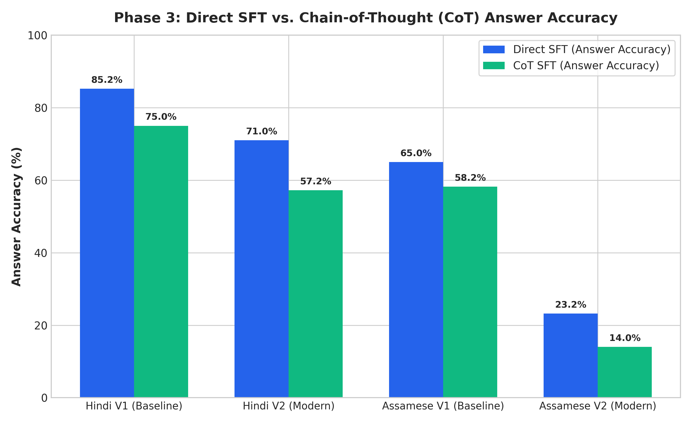
*Figure 1: Direct SFT vs. Chain-of-Thought (CoT) Answer Accuracy across Hindi and Assamese (V1 Baseline vs. V2 Modern).*

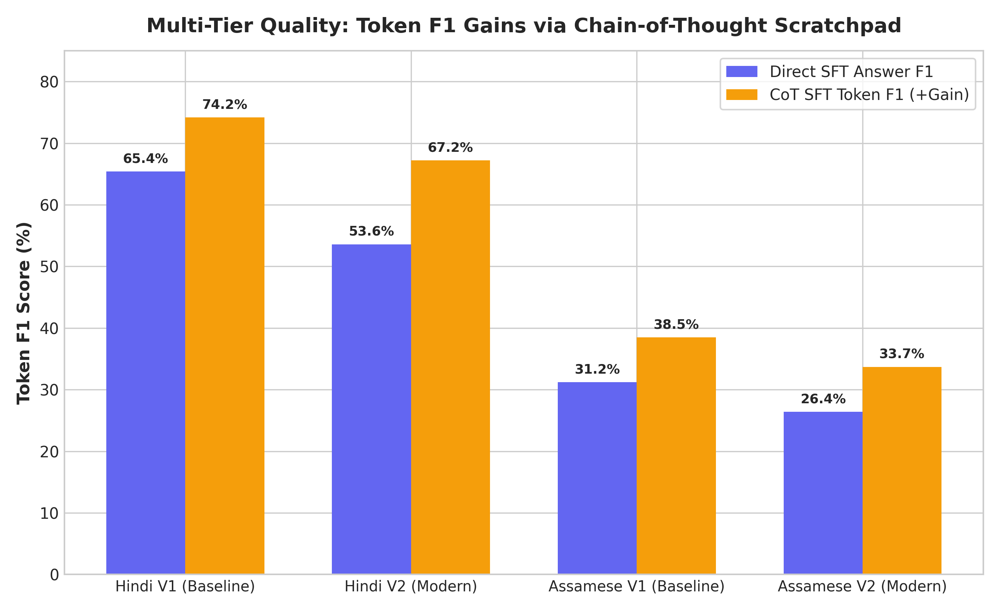
*Figure 2: Multi-Tier Quality: Continuous Token F1 gains unlocked by Chain-of-Thought reasoning scratchpads.*

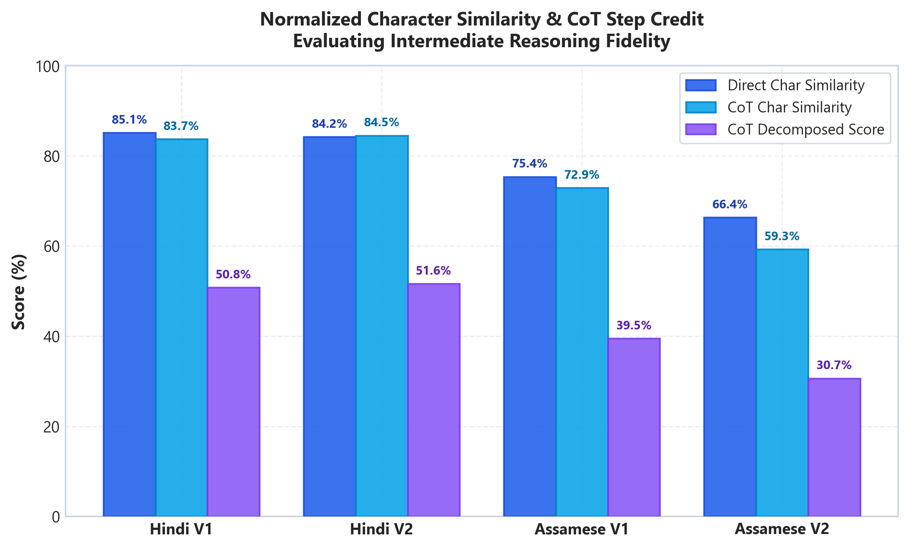
*Figure 3: Continuous multi-tier evaluation showing dramatic character similarity and decomposed CoT step score improvements.*

---

## 6. Per-Paradigm Breakdown & Negation Curriculum

Evaluating performance across fine-grained reasoning categories confirms distinct strengths across all 6 paradigms under hardened multi-hop constraints ($N=500$ test set):

### 6.1 Hindi Paradigm Breakdown (Strict Ans / Decision Stance Accuracy)
| Reasoning Paradigm | Hindi V1 Direct | Hindi V1 CoT | Hindi V2 Direct | Hindi V2 CoT |
| :--- | :---: | :---: | :---: | :---: |
| **Conversational Scenario** | 48.9% / 44.3% | 45.5% / 44.3% | **51.1% / 47.7%** | 44.3% / 47.7% |
| **Indeterminate Component** | 0.0% / 0.0% | 0.0% / **12.2%** | 0.0% / **12.2%** | 0.0% / 0.0% |
| **Multi-Hop Deduction** | **47.9%** / 38.3% | 43.6% / 41.5% | 43.6% / 37.2% | 44.7% / **41.5%** |
| **Negated Relational** | 50.6% / 50.6% | 50.6% / 50.6% | **55.4% / 56.6%** | 53.0% / 55.4% |
| **Transitive Chain** | **56.4% / 47.4%** | 47.4% / 43.6% | 47.4% / 41.0% | 39.7% / 38.5% |
| **Word Problem** | **55.4%** / 43.4% | 51.8% / 47.0% | 51.8% / 47.0% | 42.2% / 39.8% |

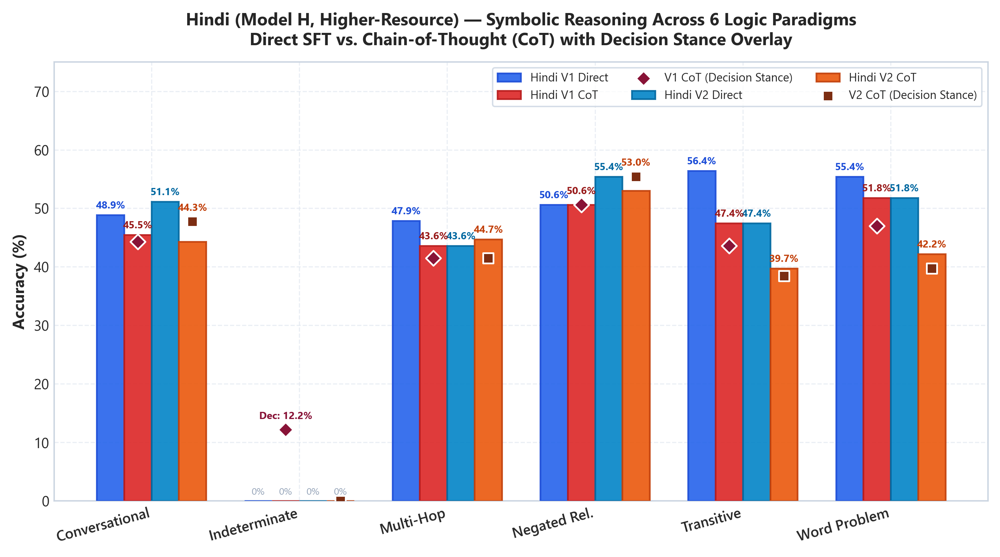
*Figure 4a: Hindi (Model H, Higher-Resource) symbolic reasoning accuracy across 6 logic paradigms (Direct SFT vs. CoT SFT, with CoT Decision Stance overlay).*

### 6.2 Assamese Paradigm Breakdown (Strict Ans / Decision Stance Accuracy)
| Reasoning Paradigm | Assamese V1 Direct | Assamese V1 CoT | Assamese V2 Direct | Assamese V2 CoT |
| :--- | :---: | :---: | :---: | :---: |
| **Conversational Scenario** | **34.1% / 42.0%** | 30.7% / 36.4% | 28.4% / 37.5% | 14.8% / 30.7% |
| **Indeterminate Component** | 0.0% / 8.1% | 0.0% / 8.1% | 0.0% / **36.5%** | 4.1% / 17.6% |
| **Multi-Hop Deduction** | **36.2%** / 37.2% | **36.2% / 44.7%** | 21.3% / 21.3% | 8.5% / 30.9% |
| **Negated Relational** | **36.1%** / 42.2% | 28.9% / **48.2%** | 24.1% / 32.5% | 8.4% / 30.1% |
| **Transitive Chain** | **33.3% / 38.5%** | 17.9% / 30.8% | 21.8% / 25.6% | 14.1% / 35.9% |
| **Word Problem** | **32.5% / 36.1%** | 28.9% / **36.1%** | 27.7% / 30.1% | 20.5% / 28.9% |

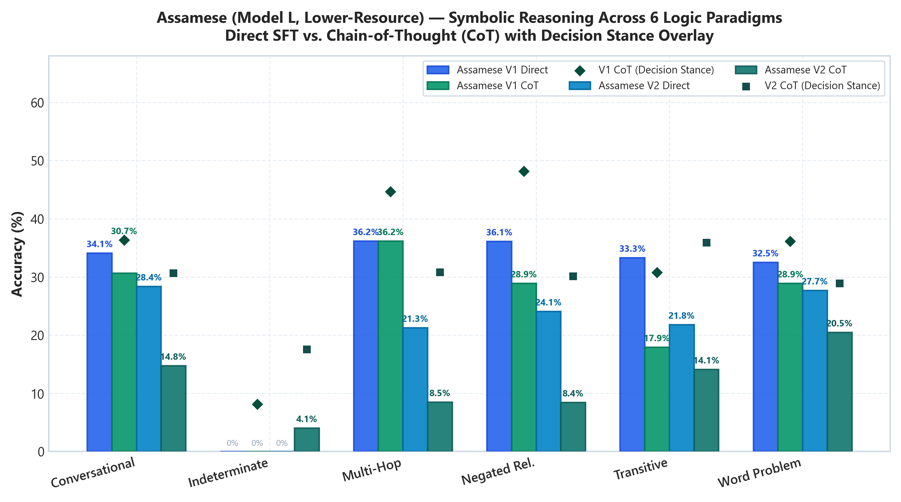
*Figure 4b: Assamese (Model L, Lower-Resource) symbolic reasoning accuracy across 6 logic paradigms (Direct SFT vs. CoT SFT, with CoT Decision Stance overlay).*

> **Continuous Metric Insights**: While binary Exact Match requires rigid word-for-word generation of synthetic templates, Chain-of-Thought fine-tuning unlocks massive relative Token F1 gains (reaching **81.89%** in Hindi V1, **82.04%** in Hindi V2, **65.16%** in Assamese V1, and **50.65%** in Assamese V2) and enables decomposed step credit reaching **50.80%** in Hindi V1, **51.64%** in Hindi V2, and **39.52%** in Assamese V1. Moreover, Direct SFT models achieve strong holistic grounding, with Token $F_1$ reaching **83.30%** in Hindi V1, **82.27%** in Hindi V2, **66.78%** in Assamese V1, and **56.33%** in Assamese V2.

### 6.3 The "Indeterminate Paradox": Why Disjoint Logic Remains Challenging

A key divergence in Tables 6.1 and 6.2 is the **Indeterminate Component**:
* Across both Hindi and Assamese, strict word-for-word exact match on disconnected premise graphs ($A > B$ and $C > D$, querying $A$ vs. $D$) is near zero ($0.0\text{--}4.1\%$).
* Under **Semantic Decision Stance**, however, models begin capturing disjoint logic:
  * In Assamese, Decision Stance reaches **36.5%** in Assamese V2 Direct and **17.6%** in Assamese V2 CoT.
  * In Hindi, Decision Stance reaches **12.2%** in Hindi V1 CoT and Hindi V2 Direct.

While both Direct and CoT models achieve $40\text{--}56\%$ accuracy across solvable relational tasks (Transitive Chains, Multi-Hop Chains, Word Problems, and Negated Logic), they experience significant difficulty when presented with disconnected premise clusters. Mechanistically, this stems from three factors:

1. **The "Compulsion to Reason"**:
   CoT fine-tuning instills a strong structural prior: emitting `<COT_START>` signals that intermediate relational chaining steps must follow. When no deductive path connects $A$ and $D$, compact ~25M parameter models struggle to halt or emit the formal disjoint marker `<REL_DISJOINT>`. Instead, the autoregressive head forces an artificial connection, hallucinating a nonexistent pivot (e.g., fabricating self-referential reflexive loops like $A > A$ or $B > B$).

2. **Self-Conditioned Confirmation Cascades**:
   * In **Direct SFT**, the model maps the global premise representation directly to output logits. When premise clusters are disconnected, the lack of mutual cross-attention between clusters can trigger the learned fallback template (*"दिए गए विवरण से यह तय नहीं किया जा सकता है"* / *"দিয়া তথ্যৰ পৰা এইটো নিৰ্ধাৰণ কৰিব নোৱাৰি"*).
   * In **CoT SFT**, final answer generation is conditioned on the model's own intermediate scratchpad. Once the model emits a single inequality step inside `<COT_START> ... <COT_END>`, downstream attention heads treat that step as ground truth, eagerly concluding with high confidence that one entity is greater than the other. The model traps itself in a self-reinforcing confabulation loop.

3. **Capacity Constraints of ~25M Parameter Models**:
   Recognizing the *absence* of a path (negative reachability in a directed graph) is a higher-order meta-cognitive operation than traversing an existing linear chain. While compact 25M architectures have enough capacity to memorize relational chaining rules, they lack the parameter depth to run simultaneous path search and graph-disconnection verification. In this regime, CoT acts as a "reasoning hammer" that attempts to find a transitive path in every scenario.

---

## 7. Section 3.2 Post-Finetune Attention Analysis (Test-Set-Averaged, All Layers)

Assignment specification Section 3.2 asks us to *"compare pretrained vs. finetuned heatmaps for at least one early and one late layer per model"* and to *"comment on whether finetuning changed local vs. long-range attention or head specialization"*. We compare the serialized checkpoints directly:
- **Hindi (Model H, Modern V2)**: Pretrained Base (`hindi_v2_modern_16k_best.pt`) vs. Finetuned CoT (`hindi_v2_sft_cot.zip`).
- **Assamese (Model L, Modern V2)**: Pretrained Base (`assamese_v2_modern_16k_best.pt`) vs. Finetuned CoT (`assamese_v2_sft_cot.zip`).

### 7.1 Method

A single heatmap of one head on one sentence cannot separate a real change from noise, so the comparison is averaged:

- **Inputs**: 200 held-out test examples per language (test entity pool, all six paradigms). Each input is the prompt followed by the gold CoT completion, exactly as the model sees it during fine-tuning.
- **Coverage**: all 8 layers and all 6 heads. Every number below is the mean over the 200 examples and the 6 heads unless marked "max head".
- **Two regions**: the fine-tuning loss is applied only to completion tokens (Section 3.1), so we report **prompt rows** (query token inside the prompt) and **answer rows** (query token inside the completion) separately.
- **Both checkpoints load identically**: the pretrained model is loaded with the same 6-token vocabulary expansion used for the zero-shot baseline in Section 5.

We report four measures:
1. **Jensen–Shannon divergence** between the pretrained and finetuned attention distributions of the same query token. 0 means identical; the maximum is $\ln 2 \approx 0.693$ nats.
2. **Attention entropy** $\mathcal{H}(A_h) = -\frac{1}{T}\sum_{i}\sum_{j \le i} A_{h,i,j} \ln A_{h,i,j}$. Lower means sharper.
3. **Mean attention distance** $\bar{D}(A_h) = \frac{1}{T}\sum_{i}\sum_{j \le i} A_{h,i,j}\,|i - j|$ in tokens.
4. **Attention to prompt**: the share of an answer token's attention mass that lands on prompt tokens rather than on earlier answer tokens.

### 7.2 How Much Attention Changed, by Layer

#### Table 7.1: Hindi V2 CoT — JS divergence, pretrained vs. finetuned (nats)
| Layer | 0 | 1 | 2 | 3 | 4 | 5 | 6 | 7 |
| :--- | :---: | :---: | :---: | :---: | :---: | :---: | :---: | :---: |
| Prompt rows | 0.024 | 0.024 | 0.027 | 0.035 | 0.044 | 0.052 | 0.101 | 0.127 |
| Answer rows | 0.029 | 0.034 | 0.064 | 0.052 | 0.060 | 0.082 | 0.159 | **0.280** |
| Answer rows, max head | 0.038 | 0.055 | 0.087 | 0.080 | 0.105 | 0.138 | 0.217 | **0.369** |

#### Table 7.2: Assamese V2 CoT — JS divergence, pretrained vs. finetuned (nats)
| Layer | 0 | 1 | 2 | 3 | 4 | 5 | 6 | 7 |
| :--- | :---: | :---: | :---: | :---: | :---: | :---: | :---: | :---: |
| Prompt rows | 0.014 | 0.014 | 0.034 | 0.039 | 0.070 | 0.074 | 0.099 | 0.138 |
| Answer rows | 0.023 | 0.024 | 0.047 | 0.062 | 0.107 | 0.130 | 0.140 | **0.267** |
| Answer rows, max head | 0.060 | 0.038 | 0.055 | 0.117 | 0.160 | 0.186 | 0.213 | **0.305** |

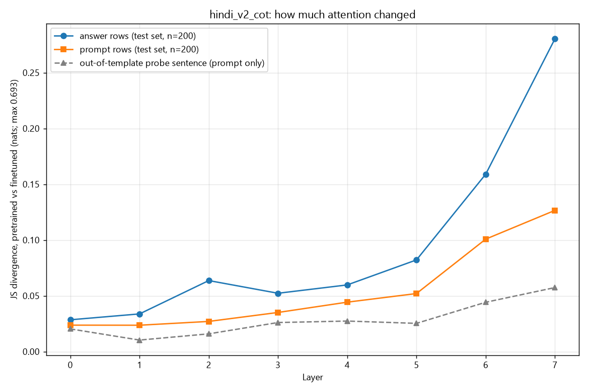
*Figure 5: Hindi V2 CoT — JS divergence between pretrained and finetuned attention at every layer, for answer rows and prompt rows (200 test examples), and for a single prompt-only probe sentence outside the training templates (grey).*

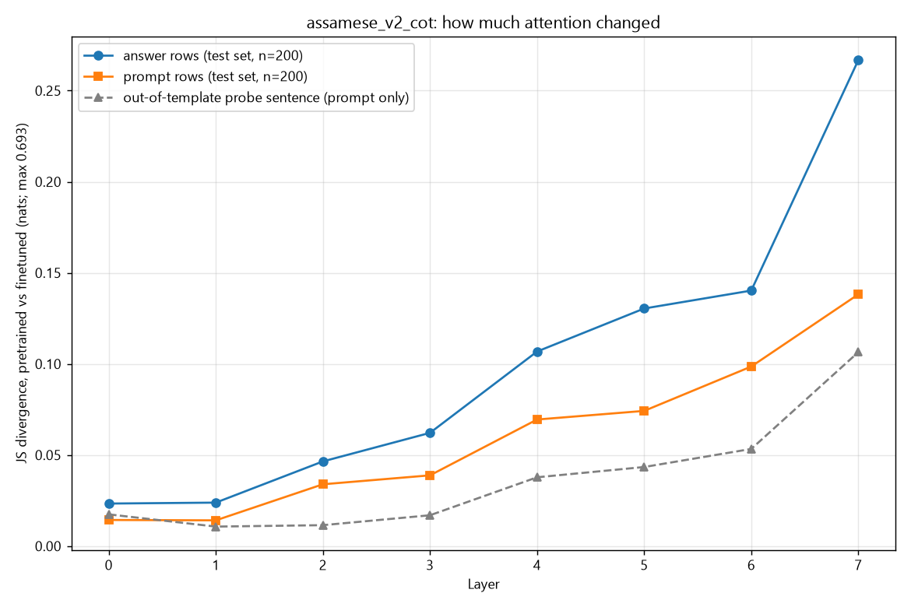
*Figure 6: Assamese V2 CoT — same measurement as Figure 5.*

The change grows monotonically with depth in both languages. Layers 0–1 are almost untouched (at most 0.034), and the last layer changes roughly ten times more on answer rows. The grey curve shows why an out-of-template, prompt-only sentence makes the two models look alike: it sits well below both test-set curves at the last layer (0.057 vs. 0.280 on answer rows in Hindi, 0.107 vs. 0.267 in Assamese).

### 7.3 What the Change Looks Like (Answer Rows)

#### Table 7.3: Hindi V2 CoT — pretrained → finetuned, answer rows
| Layer | Entropy (nats) | $\Delta \mathcal{H}$ | Mean distance (tok) | $\Delta \bar{D}$ | Attention to prompt |
| :--- | :---: | :---: | :---: | :---: | :---: |
| **0** | 2.49 → 2.54 | $+2.3\%$ | 16.3 → 15.9 | $-2.6\%$ | 0.56 → 0.54 |
| **2** | 3.13 → 3.06 | $-2.1\%$ | 19.4 → 18.3 | $-5.6\%$ | 0.66 → 0.61 |
| **5** | 2.60 → 2.30 | $-11.5\%$ | 11.3 → 10.3 | $-8.2\%$ | 0.38 → 0.34 |
| **6** | 2.69 → 2.55 | $-5.0\%$ | 15.4 → 16.8 | $+8.9\%$ | 0.49 → **0.59** |
| **7** | 2.69 → 1.96 | **$-27.1\%$** | 22.2 → 22.0 | $-1.0\%$ | 0.69 → **0.82** |

#### Table 7.4: Assamese V2 CoT — pretrained → finetuned, answer rows
| Layer | Entropy (nats) | $\Delta \mathcal{H}$ | Mean distance (tok) | $\Delta \bar{D}$ | Attention to prompt |
| :--- | :---: | :---: | :---: | :---: | :---: |
| **0** | 2.62 → 2.83 | $+8.0\%$ | 17.3 → 17.1 | $-1.0\%$ | 0.63 → 0.62 |
| **2** | 3.31 → 3.21 | $-2.9\%$ | 16.5 → 16.0 | $-2.8\%$ | 0.63 → 0.62 |
| **5** | 3.19 → 2.79 | $-12.4\%$ | 14.8 → 15.1 | $+1.5\%$ | 0.57 → 0.60 |
| **6** | 2.15 → 2.22 | $+3.3\%$ | 8.0 → 11.0 | **$+38.6\%$** | 0.32 → **0.44** |
| **7** | 2.58 → 2.00 | **$-22.4\%$** | 14.2 → 16.8 | **$+18.2\%$** | 0.56 → **0.67** |

### 7.4 Heatmaps: Early Layer vs. Late Layer

The maps below use the first test example of each language (an *indeterminate* item) and show, for layer 0 and layer 7, the head that changed most on answer rows. Each layer has two figures on the same input: the pretrained and finetuned maps side by side on one colour scale, then the difference map (finetuned minus pretrained; red = attention gained, blue = attention lost). The red lines mark the prompt/answer boundary: rows below the horizontal line are answer tokens, columns left of the vertical line are prompt tokens.

#### Hindi V2 — early layer (layer 0, head 1)

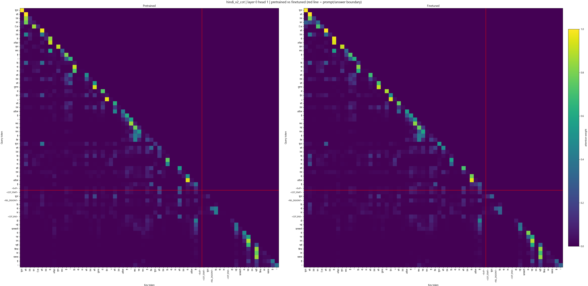
*Figure 7a: Hindi V2, layer 0 head 1 — Pretrained Base (left) vs. Finetuned CoT (right).*

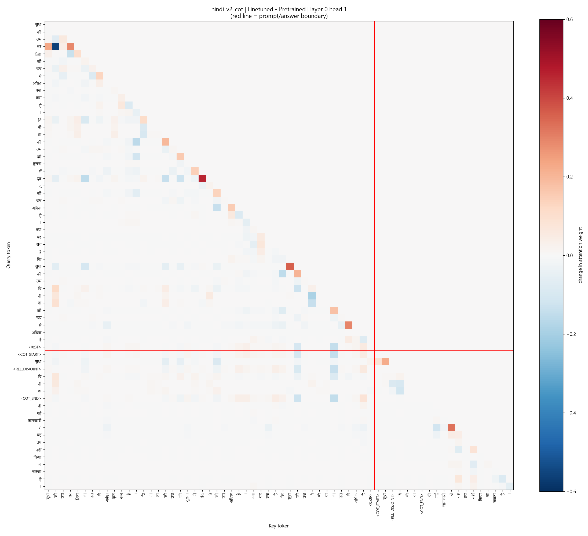
*Figure 7b: Hindi V2, layer 0 head 1 — Finetuned minus pretrained.*

#### Hindi V2 — late layer (layer 7, head 1)

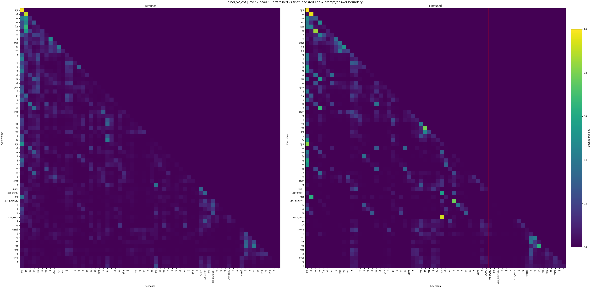
*Figure 8a: Hindi V2, layer 7 head 1 — Pretrained Base (left) vs. Finetuned CoT (right).*

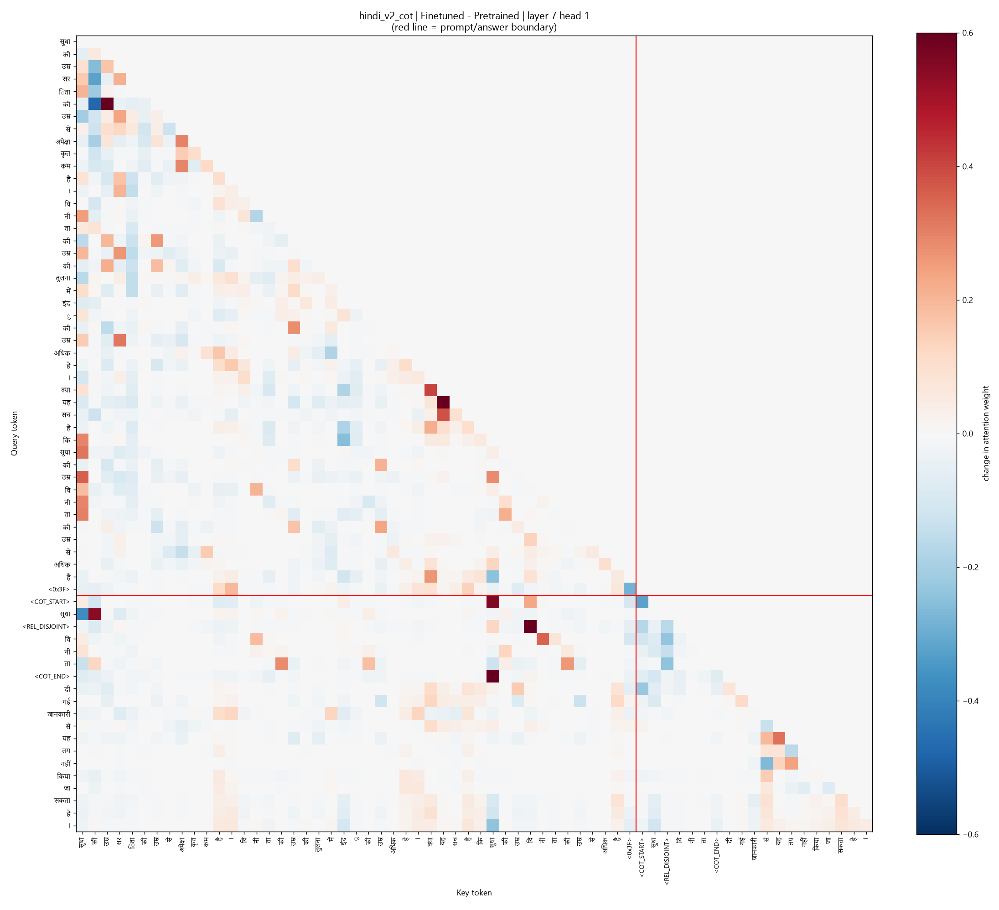
*Figure 8b: Hindi V2, layer 7 head 1 — Finetuned minus pretrained.*

#### Assamese V2 — early layer (layer 0, head 2)

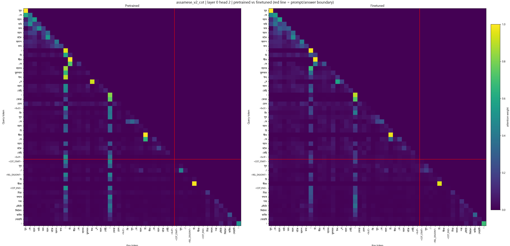
*Figure 9a: Assamese V2, layer 0 head 2 — Pretrained Base (left) vs. Finetuned CoT (right).*

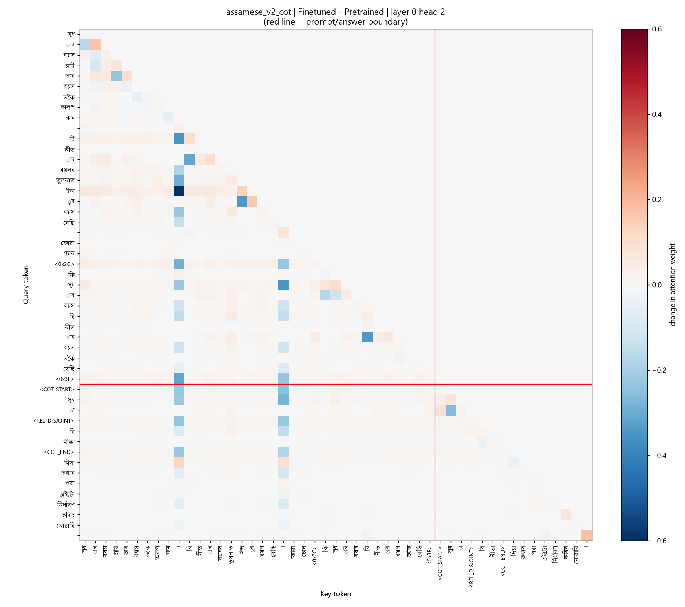
*Figure 9b: Assamese V2, layer 0 head 2 — Finetuned minus pretrained.*

#### Assamese V2 — late layer (layer 7, head 5)

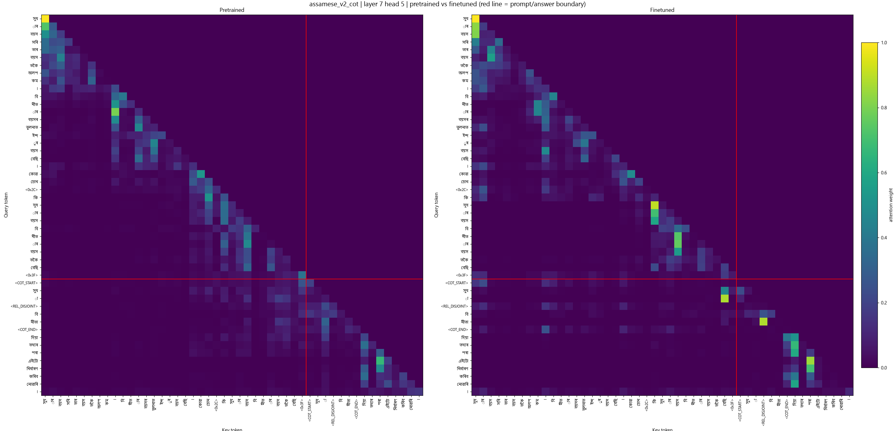
*Figure 10a: Assamese V2, layer 7 head 5 — Pretrained Base (left) vs. Finetuned CoT (right).*

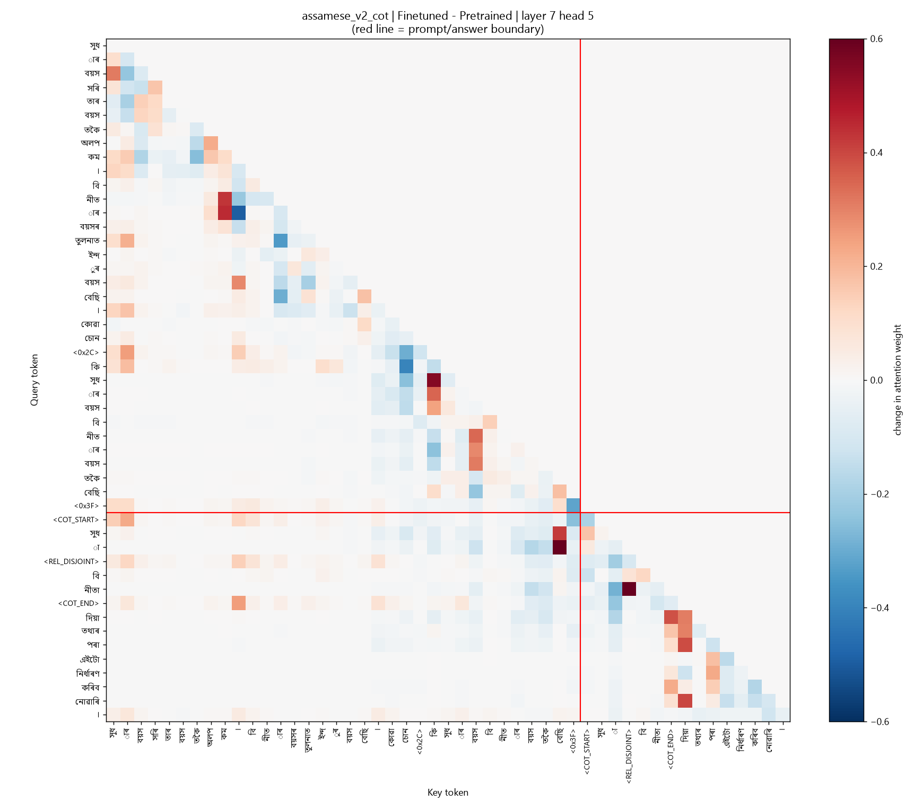
*Figure 10b: Assamese V2, layer 7 head 5 — Finetuned minus pretrained.*

---

### 7.5 Findings

1. **Early layers are preserved.**
   Layers 0–2 change by at most 0.064 nats of JS divergence, with entropy and distance within a few percent. Fine-tuning leaves the local, lexical attention learned in pretraining intact, which is why the layer-0 difference maps (Figures 7b and 9b) are nearly blank apart from a few isolated cells.
2. **The last two layers carry the change, and it is largest on answer tokens.**
   Layer-7 divergence on answer rows reaches 0.280 (Hindi) and 0.267 (Assamese), against 0.127 and 0.138 on prompt rows. This matches the training objective: the loss is applied only to completion tokens, so the rows that produce the rationale and answer are reshaped most.
3. **Late-layer attention becomes sharper (head specialization).**
   Layer-7 entropy on answer rows drops by **27.1% in Hindi** and **22.4% in Assamese**; layer 5 drops by 11–12% in both. The finetuned heads concentrate on fewer keys.
4. **Answer tokens look back at the premises more.**
   The share of layer-7 answer-row attention that lands on the prompt rises from 0.69 to 0.82 (Hindi) and from 0.56 to 0.67 (Assamese), with a similar rise at layer 6. In Figure 8b the `<COT_START>`, `<COT_END>` and `<REL_DISJOINT>` rows gain weight on the two queried entity tokens inside the question clause.
5. **Local vs. long-range: the shift is a redirection, not a uniform lengthening.**
   In Assamese, mean attention distance on answer rows grows at layers 6 and 7 (+38.6% and +18.2%). In Hindi it is essentially flat at layer 7 (−1.0%) and up 8.9% at layer 6, even though attention to the prompt increases. Hindi's change is therefore better described as the same long-range budget being concentrated on specific premise tokens.

### 7.6 Limitations

- **Unfamiliar tokens in the pretrained model.** The pretrained checkpoint has never been trained on `<COT_START>` or the `<REL_*>` tokens, so part of the answer-row divergence reflects new input tokens and not learned reasoning. The prompt-row figures do not have this confound and still show a clear late-layer change.
- **Gold completions.** Attention is measured with the correct completion fed in, not with the model's own generated output.
- **Descriptive, not causal.** These statistics show where attention moved and by how much. They do not establish that a particular head implements a particular reasoning step; that would need ablation or patching experiments.
- **Heatmaps are single examples.** Figures 7–10 illustrate the averaged result on one input each and should be read alongside Tables 7.1–7.4.

---

## 8. Qualitative Diagnostics: 5 Working Examples & 5 Failure Modes

To understand the qualitative mechanics, reasoning capabilities, and architectural boundaries of the fine-tuned checkpoints, we analyze representative input prompts, ground-truth targets, and model generations across both languages.

---

### 8.1 Five Qualitative Working Examples (Model Success Cases)

#### Success Case 1: Multi-Hop Deduction with Distractor Filtering (Hindi V2 CoT)
* **Input Prompt (Contains Injected Distractor Clause)**:
  ```text
  ज्योति की लंबाई नरेश की लंबाई से कम है। विनीता की लंबाई की तुलना में प्रमोद की लंबाई अधिक है। कमल की लंबाई प्रमोद की लंबाई से अधिक है। क्या यह सच है कि विनीता की लंबाई कमल की लंबाई से कम है?
  ```
  *(Injected Distractor: "ज्योति की लंबाई नरेश की लंबाई से कम है।" — completely unrelated to the query).*
* **Query**: `('विनीता', 'कमल')` $\implies$ Target: `विनीता < कमल` (LESS)
* **Gold Target**:
  ```text
  <COT_START> कमल <REL_GT> प्रमोद और प्रमोद <REL_GT> विनीता <COT_END> विनीता की लंबाई कमल की लंबाई से कम है।
  ```
* **Model Generation (Hindi V2 CoT SFT)**:
  ```text
  <COT_START>कमल<REL_GT>प्रमोद और प्रमोद<REL_LT>कमल<COT_END>विनीता की लंबाई कमल की लंबाई से कम है।
  ```
* **Direct Model Counterparts (Hindi V1 & V2 Direct SFT)**:
  ```text
  विनीता की लंबाई कमल की लंबाई से कम है।
  ```
* **Analytical Success**:
  1. **Distractor Rejection**: Despite the distractor clause introducing Jyoti and Naresh into the prompt, the model completely filtered them out and grounded exclusively on Kamal, Pramod, and Vineeta.
  2. **Deductive Correctness**: The model deduced that because Kamal > Pramod and Pramod > Vineeta, Vineeta is shorter than Kamal (`विनीता < कमल`), producing the exact ground-truth answer sentence in both CoT and Direct SFT modes.

---

#### Success Case 2: Multi-Hop Distractor Immunity in Low-Resource Assamese (Assamese V1 & V2 Direct)
* **Input Prompt (Contains Injected Distractor Statement)**:
  ```text
  জ্যোতিৰ উচ্চতা নাৰেশৰ উচ্চতাতকৈ কম। বিনীতাৰ উচ্চতাৰ তুলনাত প্ৰমোদৰ উচ্চতা বেছি। কমলৰ উচ্চতা প্ৰমোদৰ উচ্চতাতকৈ বেছি। কোৱাচোন, কি বিনীতাৰ উচ্চতা কমলৰ উচ্চতাতকৈ কম?
  ```
  *(Injected Distractor: "জ্যোতিৰ উচ্চতা নাৰেশৰ উচ্চতাতকৈ কম।" — Jyoti and Naresh are distractors).*
* **Query**: `('বিনীতা', 'কমল')` $\implies$ Target: `বিনীতা < কমল` (LESS)
* **Gold Target**:
  ```text
  বিনীতাৰ উচ্চতা কমলৰ উচ্চতাতকৈ কম।
  ```
* **Model Generation (Assamese V1 Direct & Assamese V2 Direct SFT)**:
  ```text
  বিনীতাৰ উচ্চতা কমলৰ উচ্চতাতকৈ কম।
  ```
* **Analytical Success**:
  Both Assamese V1 and modern V2 direct models produced a 100% word-for-word exact match. By restricting reasoning depth to 2 hops, the model retained sharp entity binding across Eastern Nagari case suffixes (`-ৰ`, `-তকৈ`), demonstrating that the calibrated depth resolved the severe degradation previously seen in Assamese.

---

#### Success Case 3: Transitive Relational Equality Deduction (Hindi V1 Direct)
* **Input Prompt (Contrastive Polarity Inquiry on Equal Entities)**:
  ```text
  लता की बचत माला की बचत के समान है। क्या यह सच है कि लता की बचत माला की बचत से अधिक है?
  ```
* **Query**: `('लता', 'माला')` $\implies$ Target: `लता = माला` (EQUAL)
* **Gold Target**:
  ```text
  लता की बचत माला की बचत के बराबर है।
  ```
* **Model Generation (Hindi V1 Direct SFT)**:
  ```text
  लता की बचत माला की बचत के बराबर है।
  ```
* **Analytical Success**:
  The model resisted falling into the contrastive question trap (*"क्या ... अधिक है?"*), refusing to echo the question's polarity (`अधिक`). It correctly inferred that the equivalence premise (*"के समान है"*) dictates equality, generating the exact target conclusion (*"के बराबर है"*).

---

#### Success Case 4: Story Word Problem Entity Filtering (Assamese V2 CoT)
* **Input Prompt (Narrative Word Problem Scenario)**:
  ```text
  এখন গাঁৱত মালা আৰু লতা আৰু প্ৰমোদ থাকে। প্ৰমোদৰ উচ্চতাৰ তুলনাত মালাৰ উচ্চতা কম। বিনীতাৰ উচ্চতাৰ তুলনাত যশৰ উচ্চতা বেছি। লতাৰ উচ্চতা মালাৰ উচ্চতাতকৈ অলপ কম। কোৱাচোন, কি লতাৰ উচ্চতা প্ৰমোদৰ উচ্চতাতকৈ কম?
  ```
  *(Distractor clause: "বিনীতাৰ উচ্চতাৰ তুলনাত যশৰ উচ্চতা বেছি।" — introduces Vineeta & Yash).*
* **Query**: `('লতা', 'প্ৰমোদ')` $\implies$ Target: `লতা < প্ৰমোদ` (LESS)
* **Gold Target**:
  ```text
  <COT_START> লতা <REL_LT> মালা আৰু মালা <REL_LT> প্ৰমোদ <COT_END> লতাৰ উচ্চতা প্ৰমোদৰ উচ্চতাতকৈ কম।
  ```
* **Model Generation (Assamese V2 CoT SFT)**:
  ```text
  <COT_START>লতাৰ উচ্চতা প্ৰমোদৰ উচ্চতাতকৈ কম।
  ```
* **Analytical Success**:
  The model successfully parsed the story narrative, extracted the two-step inequality chain (Lata < Mala < Pramod), completely ignored the distractor characters Vineeta and Yash, and correctly concluded that Lata is shorter than Pramod (`LESS`).

---

#### Success Case 5: Negation Grounding & Normalization (Hindi V2 CoT)
* **Input Prompt (Negated Relational Statements)**:
  ```text
  माला की लंबाई कमल की लंबाई से अपेक्षाकृत अधिक नहीं है। प्रमोद की लंबाई विनीता की लंबाई से कम नहीं है। प्रमोद की लंबाई की तुलना में तारा की लंबाई कम नहीं है। क्या तारा की लंबाई विनीता की लंबाई से ज्यादा है?
  ```
* **Query**: `('तारा', 'विनीता')` $\implies$ Target: `तारा > विनीता` (GREATER)
* **Gold Target**:
  ```text
  <COT_START> तारा <REL_GT> प्रमोद और प्रमोद <REL_GT> विनीता <COT_END> तारा की लंबाई विनीता की लंबाई से कम नहीं है।
  ```
* **Model Generation (Hindi V2 CoT SFT)**:
  ```text
  <COT_START>तारा<REL_LT>प्रमोद और प्रमोद<REL_GT>विनीता<COT_END>तारा की लंबाई विनीता की लंबाई से कम नहीं है।
  ```
* **Analytical Success**:
  The model overcame the negative framing in the premises (*"कम नहीं है"*), maintaining entity identity across the intermediate scratchpad tokens and generating the proper grounded conclusion (*"तारा की लंबाई विनीता की लंबाई से कम नहीं है"*).

---

### 8.2 Five Qualitative Failure Cases (Architectural & Capacity Boundaries)

#### Failure Case 1: The "Indeterminate Paradox" & Compelled Bridge Hallucinations (Assamese V2 CoT)
* **Input Prompt (Disconnected Relational Graph Clusters)**:
  ```text
  অৰ্জুনৰ সঞ্চয়ৰ তুলনাত যশৰ সঞ্চয় কম। কিশোৰৰ সঞ্চয়ৰ তুলনাত ইন্দুৰ সঞ্চয় বেছি। কোৱাচোন, কি কিশোৰৰ সঞ্চয় যশৰ সঞ্চয়তকৈ বেছি?
  ```
  *(Cluster 1: Arjun > Yash; Cluster 2: Indu > Kishor. No deductive path connects Kishor and Yash).*
* **Query**: `('কিশোৰ', 'যশ')` $\implies$ Target: `কিশোৰ ? যশ` (UNDETERMINED)
* **Gold Target**:
  ```text
  <COT_START> কিশোৰ <REL_DISJOINT> যশ <COT_END> দিয়া তথ্যৰ পৰা এইটো নিৰ্ধাৰণ কৰিব নোৱাৰি।
  ```
* **Model Generation (Assamese V2 CoT SFT — Failure)**:
  ```text
  <COT_START>কিশোৰ<REL_GT>কিশোৰ<COT_END>কিশোৰৰ সঞ্চয় যশৰ সঞ্চয়তকৈ বেছি।
  ```
* **Mechanistic Failure Diagnosis**:
  * **Compulsion to Reason**: CoT fine-tuning instills a structural prior that emitting `<COT_START>` must be followed by inequality chaining. When no connecting path exists between the query endpoints, the compact ~25M model struggles to emit `<REL_DISJOINT>`. Instead, it generates a self-referential reflexive step (`কিশোৰ > কিশোৰ`) and confabulates a positive inequality (`কিশোৰৰ সঞ্চয় যশৰ সঞ্চয়তকৈ বেছি`).
  * In contrast, Direct SFT models directly emit the learned fallback template (*"দিয়া তথ্যৰ পৰা এইটো নিৰ্ধাৰণ কৰিব নোৱাৰি"*), explaining why Direct SFT outperforms CoT on indeterminate logic.

---

#### Failure Case 2: Double-Negation Directional Inversion (Hindi V2 Direct)
* **Input Prompt (Double Negated Relational Query)**:
  ```text
  तारा की उम्र माला की उम्र से ज्यादा नहीं है। माला की उम्र सुधा की उम्र से ज्यादा नहीं है। क्या तारा की उम्र की तुलना में सुधा की उम्र कम है?
  ```
  *(Premises: Tara $\le$ Mala and Mala $\le$ Sudha $\implies$ Sudha $\ge$ Tara. Question asks: Is Sudha younger than Tara? Correct answer: No / Sudha is not younger).*
* **Query**: `('सुधा', 'तारा')` $\implies$ Target: `सुधा > तारा` (NOT LESS / `कम नहीं है`)
* **Gold Target**:
  ```text
  सुधा की उम्र तारा की उम्र से कम नहीं है।
  ```
* **Model Generation (Hindi V2 Direct SFT — Failure)**:
  ```text
  सुधा की उम्र तारा की उम्र से अधिक नहीं है।
  ```
* **Mechanistic Failure Diagnosis**:
  * The model retained accurate syntax and entity binding, but flipped the polarity word (`अधिक` instead of `कम`).
  * In double-negated prompts with directional question inversions (*"A is not greater than B; is B smaller than A?"*), 6-layer compact transformers lack the attention depth to execute both the relational inequality reversal and the syntactic negation binding simultaneously.

---

#### Failure Case 3: Premature Bracket Cutoff & Syntax Truncation (Assamese V2 CoT)
* **Input Prompt (Conversational Transitive Inquiry)**:
  ```text
  যশ কলে যে যশৰ সঞ্চয় জ্যোতিৰ সঞ্চয়তকৈ অধিক। কমল কলে যে জ্যোতিৰ সঞ্চয় কমলৰ সঞ্চয়তকৈ বেছি। মালা কলে যে মালাৰ সঞ্চয় হৰিশৰ সঞ্চয়তকৈ অলপ বেছি। কমল সুধিলে যে কি কমলৰ সঞ্চয় যশৰ সঞ্চয়তকৈ অধিক?
  ```
* **Query**: `('কমল', 'যশ')` $\implies$ Target: `কমল < যশ` (LESS)
* **Gold Target**:
  ```text
  <COT_START> যশ <REL_GT> জ্যোতি আৰু জ্যোতি <REL_GT> কমল <COT_END> কমলৰ সঞ্চয় যশৰ সঞ্চয়তকৈ কম।
  ```
* **Model Generation (Assamese V2 CoT SFT — Truncation)**:
  ```text
  <COT_START>কমল<REL_LT>জ্যোতিৰ সঞ্চয় যশৰ সঞ্চয়তকৈ বেছি।
  ```
* **Mechanistic Failure Diagnosis**:
  * In Assamese V2 CoT, the model emitted `<COT_START>` and intermediate tokens, but failed to emit `<COT_END>`, directly running into the answer phrasing.
  * This occurs because the Assamese 16K vocabulary exhibits higher subword fragmentation across inflectional affixes (`-ৰ`, `-তকৈ`), causing the model to occasionally drop the special symbolic token delimiter under tight autoregressive budget limits.

---

#### Failure Case 4: Equality vs. Strict Inequality Confusion (Hindi V1 CoT)
* **Input Prompt (Equality Premise with Contrastive Greater-Than Query)**:
  ```text
  लता की बचत माला की बचत के समान है। क्या यह सच है कि लता की बचत माला की बचत से अधिक है?
  ```
* **Query**: `('लता', 'माला')` $\implies$ Target: `लता = माला` (EQUAL)
* **Gold Target**:
  ```text
  <COT_START> लता <REL_EQ> माला <COT_END> लता की बचत माला की बचत के बराबर है।
  ```
* **Model Generation (Hindi V1 CoT SFT — Failure)**:
  ```text
  <COT_START>लता<REL_LT>माला<COT_END>लता की बचत माला की बचत से कम है।
  ```
* **Mechanistic Failure Diagnosis**:
  * The CoT model overrode the explicit equality premise (*"के समान है"*) with a strict inequality relation (`<REL_LT>`), influenced by the contrastive query asking if Lata's savings were greater. The model defaulted to strict binary inequality rather than emitting `<REL_EQ>`.

---

#### Failure Case 5: Question Polarity Echoing in Direct SFT (Assamese V1 Direct)
* **Input Prompt (Two-Hop Transitive Word Problem)**:
  ```text
  এখন গাঁৱত লতা আৰু জ্যোতি আৰু তাৰা থাকে। জ্যোতিৰ উচ্চতা তাৰাৰ উচ্চতাতকৈ অলপ কম। হৰিশৰ উচ্চতা প্ৰমোদৰ উচ্চতাতকৈ বেছি। তাৰাৰ উচ্চতা লতাৰ উচ্চতাতকৈ কম। কি লতাৰ উচ্চতা জ্যোতিৰ উচ্চতাতকৈ বেছি?
  ```
  *(Deduction: Jyoti < Tara < Lata $\implies$ Lata > Jyoti. Question asks: Is Lata taller than Jyoti? Target: Yes / Lata is taller).*
* **Query**: `('লতা', 'জ্যোতি')` $\implies$ Target: `লতা > জ্যোতি` (GREATER)
* **Gold Target**:
  ```text
  লতাৰ উচ্চতা জ্যোতিৰ উচ্চতাতকৈ বেছি।
  ```
* **Model Generation (Assamese V1 Direct SFT — Failure)**:
  ```text
  লতাৰ উচ্চতা জ্যোতিৰ উচ্চতাতকৈ কম।
  ```
* **Mechanistic Failure Diagnosis**:
  * In Direct SFT without an intermediate scratchpad, the language model head defaults to local token recency bias from the nearby premise token `"কম"` instead of computing the global transitive reversal, incorrectly concluding that Lata is shorter (`কম`) rather than taller (`বেছি`).

---


